# 张老师PTA题目解析

答案基本以`《c++ primer》`书中内容作为参考，解析中`“P***”`字样默认本书页码。

## 选择题

### 2-1析构函数


解析：D. 对于析构函数（destructor）。1.作用：释放对象使用的资源，并销毁非static成员。2.特点：没有返回值，不接受参数；名字由波浪号`~`接类名构成；不能被重载，对于给定类，析构函数唯一。（P444）

### 2-2 静态成员

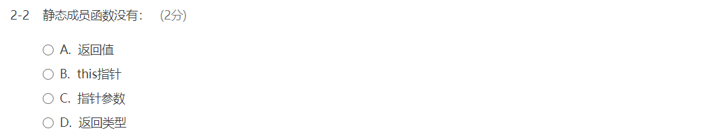

解析：B. `"类似的，静态成员函数也不与任何对象绑定在-起，它们不包含this指针。作为结果，静态成员函数不能声明成const的，而且我们也不能在static函数体内使用this指针。"`(P269中)

### 2-3读程会意

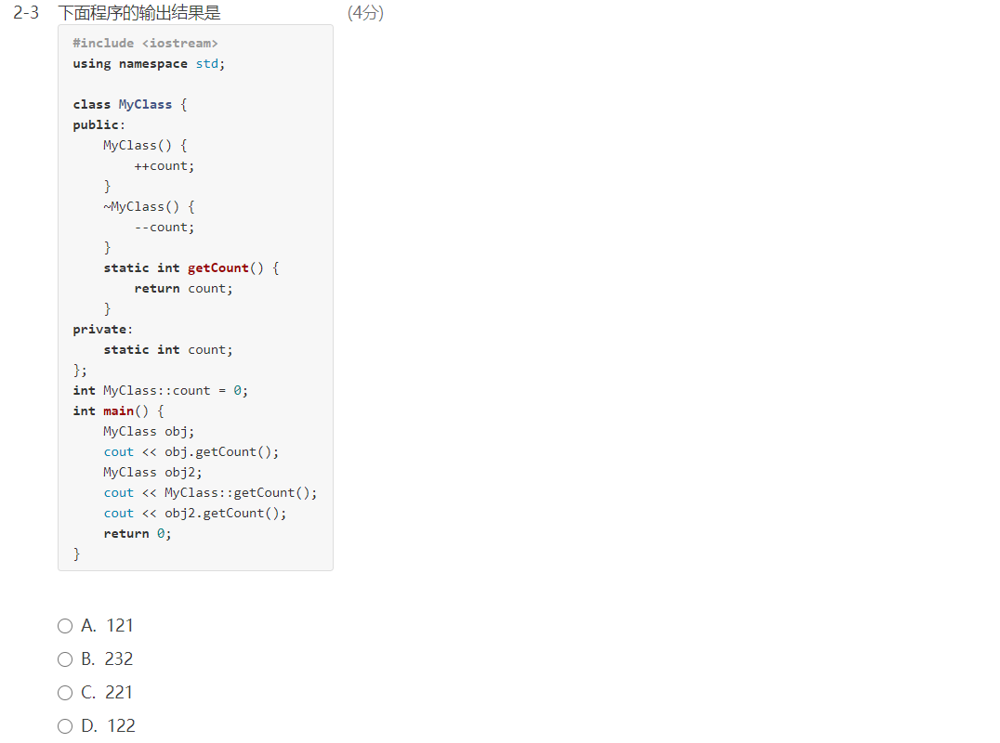

解析：D. `MyClass obj;`调用构造函数，count++，值为1，输出1；`MyClass obj2;`调用构造函数，由于私有成员count为static成员，所以能被所有MyClass实例调用，执行此语句后count在1的基础上++，值为2；后同；输出结果为`122`。

进一步了解静态成员可以了解一下此链接最后的例子[百度百科静态成员]([https://baike.baidu.com/item/%E9%9D%99%E6%80%81%E6%88%90%E5%91%98/9569025?fr=aladdin](https://baike.baidu.com/item/静态成员/9569025?fr=aladdin))。

### 2-4 读程会意

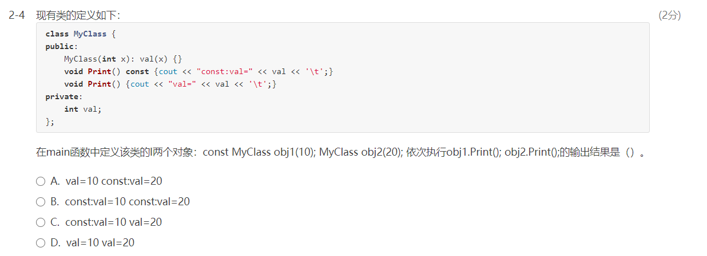

解析：	C. 首先我们明确`const MyClass ohj1(10)`调用的是`void Print() const {cout<<"const:val="<<val<<'\t';}`，`MyClass ohj2(20)`调用的是`void Print() {cout<<"const:val="<<val<<'\t';}`，所以根据类定义，可以得到输出为C。

[const用于函数重载的区分](https://www.cnblogs.com/qingergege/p/7609533.html)

[类成员函数后加const](https://www.cnblogs.com/zhangnianyong/p/5552136.html)

### 2-5静态成员

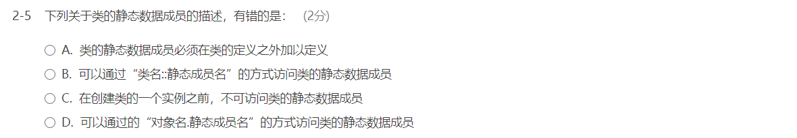

解析：B，D通过前面的题目应该没有疑问。

对于A，`“因为静态数据成员不属于类的任何一个对象， 所以它们并不是在创建类的对象时被定义的。这意味着它们不是由类的构造函数初始化的。而且一般来说， 我们不能在类的内部初始化静态成员。相反的，<u>*必须在类的外部定义和初始化每个静态成员*</u>。和其他对象一样，一个静态数据成员只能定义一次。”`（P270中上），故正确。

对于C，其实是可以通过B的方式访问的。

### 2-6静态成员

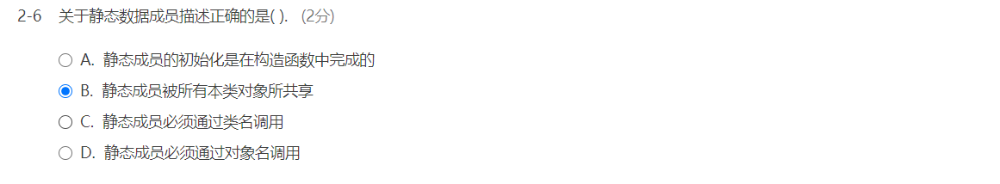

答案：B。

### 2-7子对象初始化

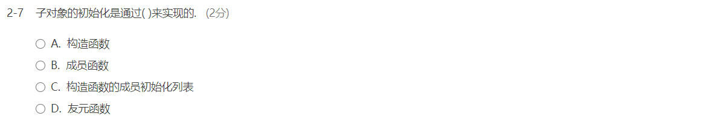

答案：C。P258.

### 2-8友元函数

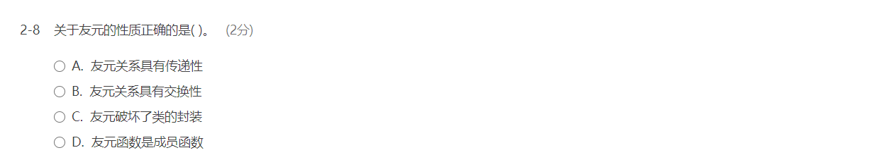

解析：C。 A、B错误，友元关系没有传递性和交换性；C，通过友元，类可以允许其他类或者函数访问它的非公有成员，可以说是破坏了封装，正确。D.“友元声明只能出现在类定义的内部，但是在类内出现的具体位置不限。`友元不是类的成员也不受它所在区域访问控制级别的约束`。”（P242上）故D错误。

### 2-9静态成员

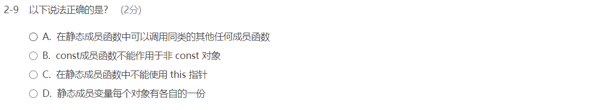

解析：C.在之前静态成员的题目中出现过，静态成员函数没有this指针。

### 2-10 this指针

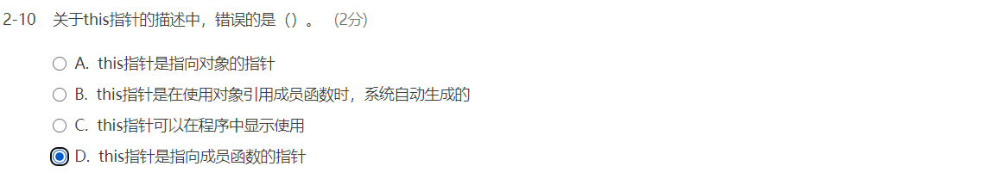

解析：A：“`因为this的目的总是指向“这个”对象`，所以this是一个常量指针(参见2.4.2节，第56页)，我们不允许改变this中保存的地址。”（P231下），相对应的D错误，选D。B、C均正确。

### 2-11静态成员

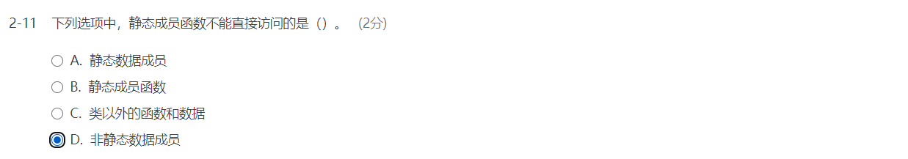

答案：D。[reference](https://blog.csdn.net/yanxuetao/article/details/34516923)

### 2-12析构函数

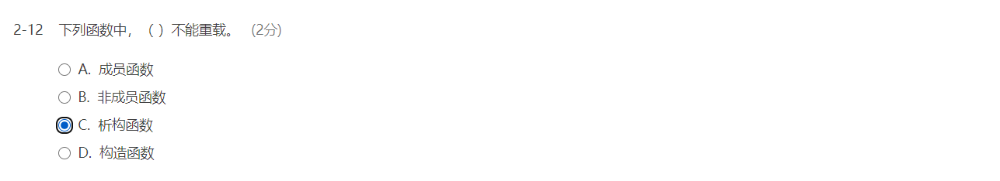

答案：C，见2-1解析。

### 2-13 类的声明

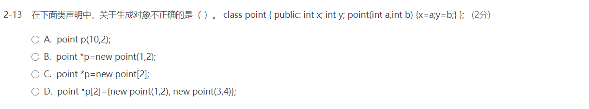

答案：C。

### 2-14 构造函数

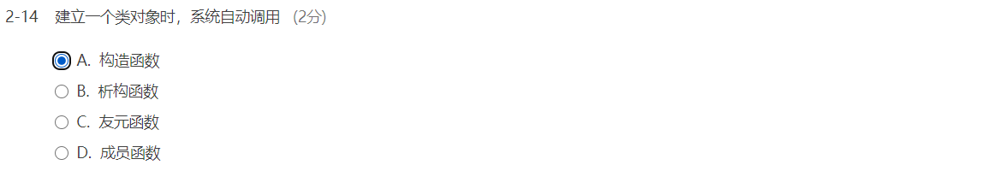

答案：A。

### 2-15 读程

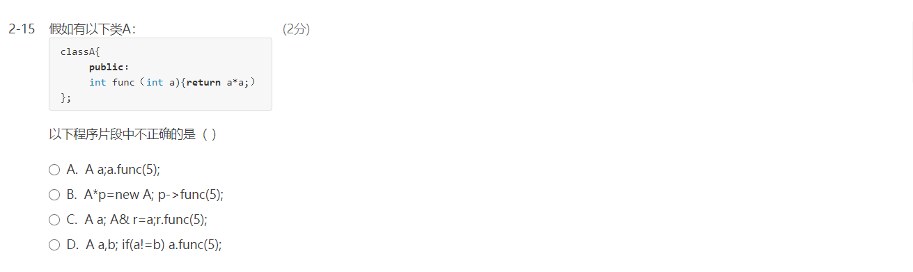

答案：D。g++编译发现"no match for operator !="。

### 2-16 读程

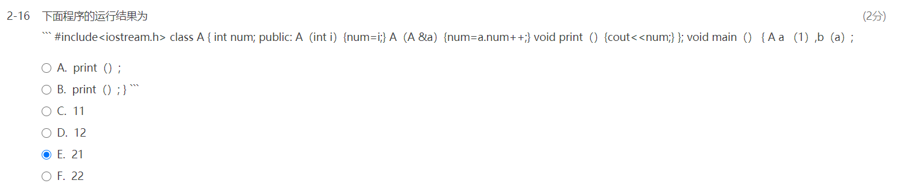

答案：E。（A，B选项其实是错位，应该为`A.print(); B.print()`）。`A a(1)`将a.num初始化为1，而`b(a)`调用了拷贝构造函数，b.num=a.num++。**<u>*（特别注意这种表达式赋值和自增顺序，++在变量右时，先赋值，后自增；++在变量左时，先自增后赋值）*</u>**所以b.num=1, a.num自增后为2。输出结果为21。

后面几道题十分简单，直接给出答案。

### 2-17~2-20 构造函数、析构函数、new

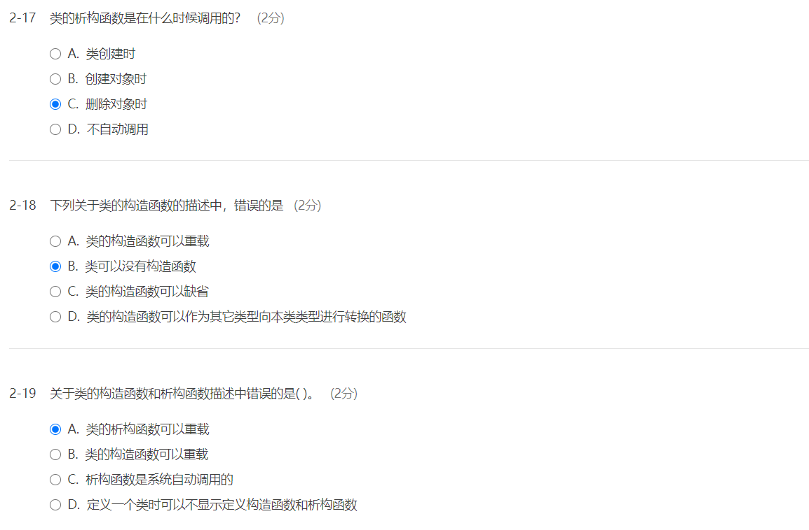

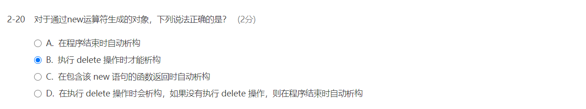


## 填空题

### 5-1拷贝构造函数


答案如图，根据CAT的构造函数，我们很容易类似地写出它地拷贝构造函数。

### 5-2多态


题目中，A为基类，B为派生类，B中对void f()进行了重载，由于A的void f（）为虚函数。基类A的引用调用虚函数，动态绑定。（其实第三个空结果可以为`p.`，输出一样，且这样更符合题目用意）

```c++
#include <iostream>

using namespace std;

class A{
public:
  virtual void f(){cout<<"A::f()"<<endl;}
};

class B:public A{
public:
  void f(){cout<<"B::f()"<<endl;}
};

int main()
{
  B b;
  A &p=b;
  p.f();
	return 0;
}

  
```

### 5-3