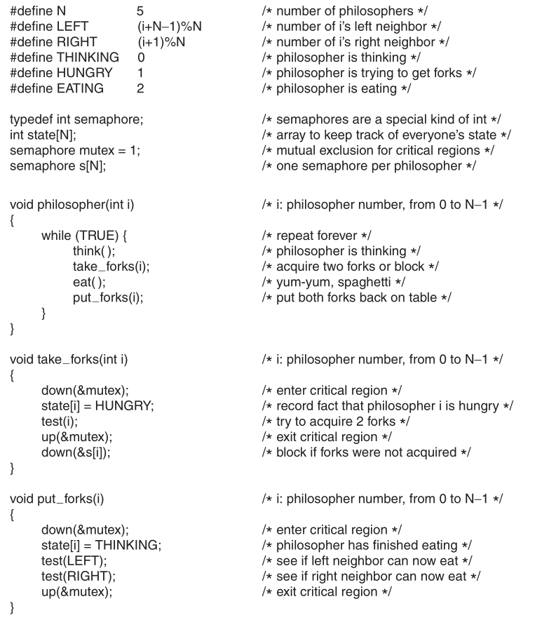

# 2020OS回忆版本

2020OS题型有些偏，比如hello次数那道题，有些老师并没有讲过execl或者只提了一嘴，考试的时候很多同学都遗忘了，另外对细节概念的考察也比较多，有些还没有直接答案，比如busy waiting和semaphore的异同，需要老师上课讲课时认真听讲并自己有一定理解。

本文所说原书为 *Modern Operating System (4th edition)*

## 题型

第一部分选择题 10*1

第二部分填空题 10*1

第三部分 简答题 5*6

第四部分 大题 5*10

## Part I

## Part II

security包括哪些方面

process状态有哪些

spin lock use \__?

process定义

TLB 是什么（翻译过来就行）

shared library is also called\__?

Thread is also call \__ process.

## Part III

1. Difference between semaphore and busy-waiting.

2. Register LOCK.给出两个LOCK的值（图来自原书，考试是需要填空），LOCK的初始值，以及`XCHG REGISTER,LOCK`能否替换成`MOV REGISTER2, LOCK`, `MOV LOCK REGISTER`,`MOV REGISTER REGISTER2`, 并解释原因。

   

3. For quota list, why it limits the number of files？

4. Give an example of circular wait that will not lead to deadlock.

5. How many "hello" will be printed?

   ```c
   int main()
   {
       fork();
       printf("hello\n");
       execl("/bin/ls","ls","-l",0);
       printf("hello\n");
   }
   ```

   

## Part IV

1. The difference between  Programmed I/O, Interrupt-driven I/o and I/O using DMA.（答案参见老师PPT）

2. Dining philosopher. Give out the test(). 答案见原书IPC问题Dining philosopher部分。

   

3. 银行家算法计算是否处于安全状态。[点击查看例题](./OS_EXR.md)

4. The difference between bitmap allocation and list allocation.看原书或PPT自行理解。

5. LRU\OPT PRA 计算缺页次数。[点击查看例题](./OS_EXR.md)
