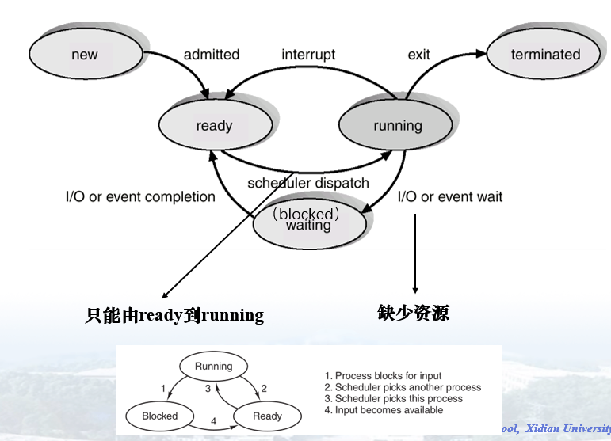
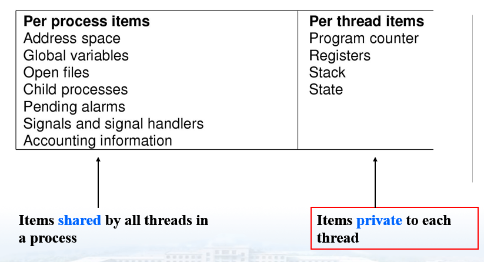
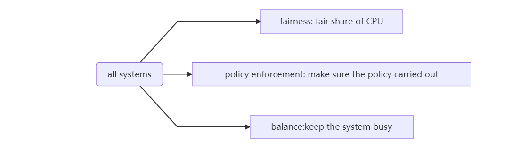
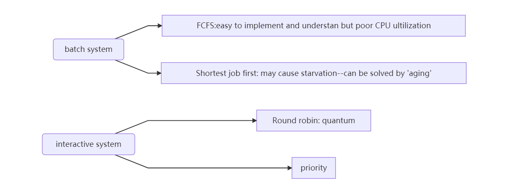
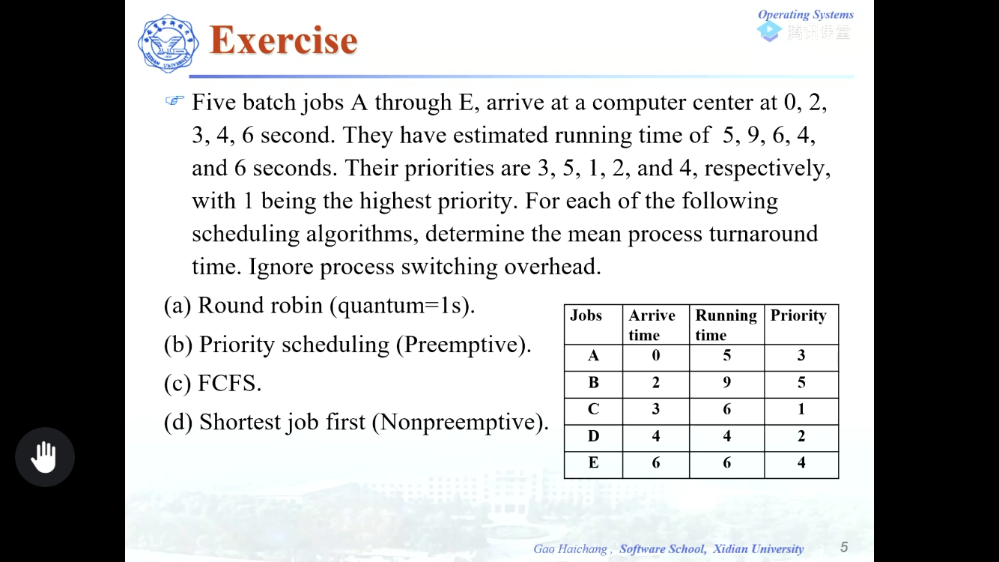
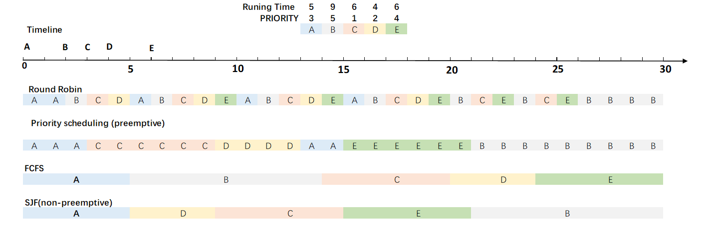
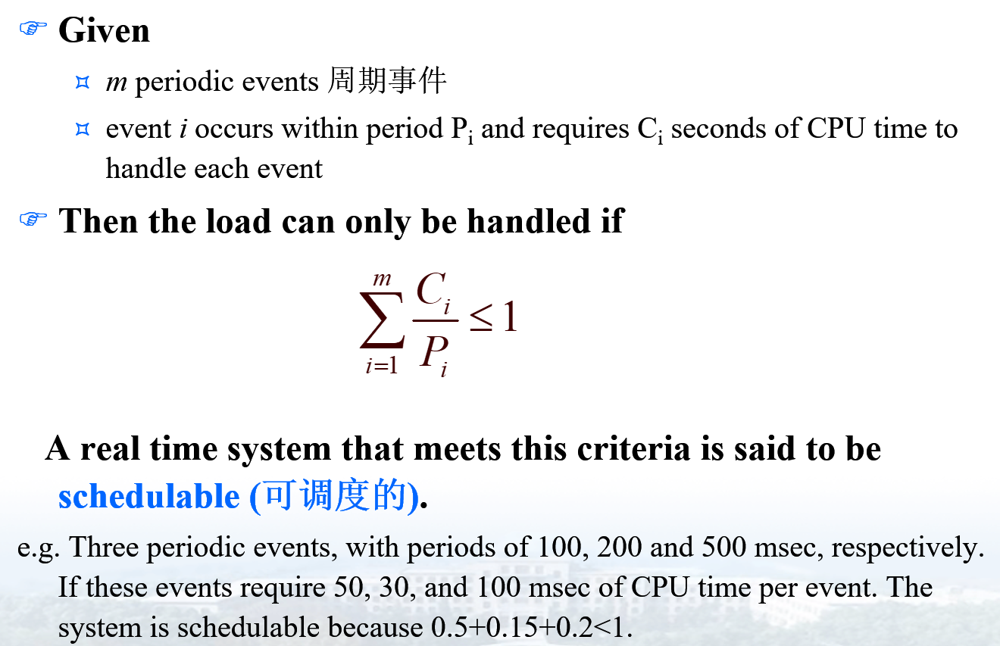
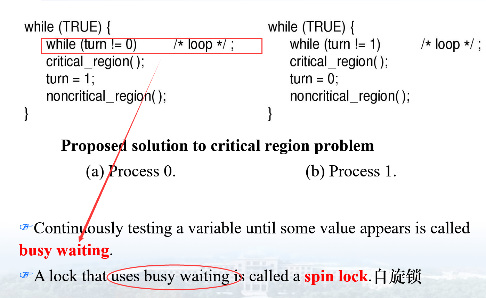
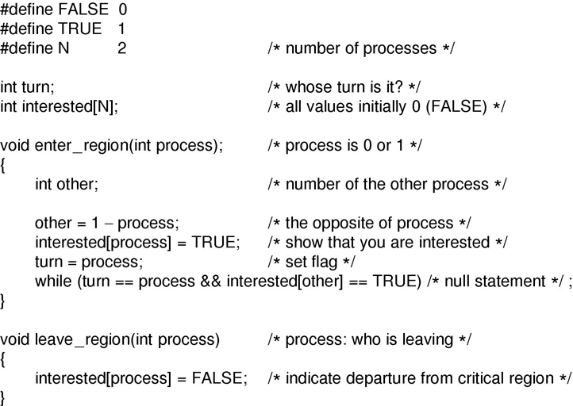
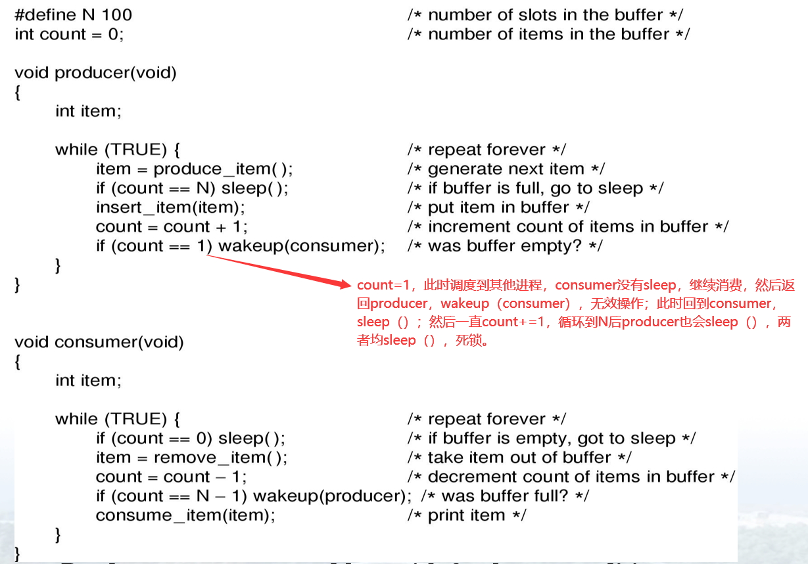

## 操作系统课程内容
## CHAPTER 1 INTRODUCTION

> - **-操作系统定义**（问答题）
>
> 操作系统的历史|分类（概念，填空）
>
> - **系统调用**（重点，PPT图）
>
> 系统结构：单一结构、微内核结构

## CHAPTER 2 PROCESSES AND THREADS

> - ==什么是进程，什么是线程、区别==
> - ==进程转移图，进程切换==
> - 调度（了解unix，多核调度）//应该是考**调度算法**
> - 进程间通信，并发、关键区(记，选择题)、信号量（代码记，可能要写）、同步、互斥
> - 经典IPC问题//估计可能考一个大题，读者写者

### process

#### ==concept:==

`An executing program including the current values of the program counter, register and varables.`

> A process consists of ?
>
> A process includes `program counter`,`stack`,`data section`

#### process creation

> 1. `System initialization`
>    系统启动时，很多进程被初始化
>    （When an operating system is booted, typically numerous processes are created.）
> 2. Execution of a process-creation `system call` by a running process
>    正在运行的进程可以通过系统调用创建一个或多个新进程来帮助自己完成任务。
>    (Often a running process will issue system calls to create one or more new processes to help it do its job.)
> 3. A `user request` to create a new process.
>    交互式系统中，用户可以通过命令行和双击图标来运行程序(In interactive systems, users can start a program by typing a command or (dou-ble) clicking on anicon.)
> 4. Initiation of a batch job.

#### program termination

> 1. Normal exit (voluntary).
>
>    绝大多数程序完成任务后正常退出（Most processes terminate because they have done their work.）
>
> 2. Error exit (voluntary).
>    When process `finds Fatal error` .
>    e.g. compile program foo.c only to find no such file exists.例子：编译foo.c但是文件不存在
>
> 3. Fatal error (involuntary).
>    an error `caused by` the process, often due to a program bug因进程出错导致fatal error，通常是因为程序有bug
>
> 4. Killed by another process (involuntary).
>
>    The process executes a system call telling the operating system to kill some other process.
>
>    1.父进程杀子进程
>
>    - exceeded allocated resources 超量分配资源
>    - task assigned no longer required 过了时效性
>    - parent is exiting 父进程退出
>
> ​          2.优先级高的进程杀优先级低的进程
>
> ​          3.死锁

#### process hierarchy

- unix calls this `process group`&`process tree`
- windows : all processes are allocated equally

#### Process state

> 对原书上图的解释（上图底部小图）
>
> - Transition :one: occurs when the operating system discovers that a process cannot continue right now.( Wait for input or other resources) 所需资源（如input）没有分配不能即刻运行
> - Transition:two:&:three: are caused by the process scheduler. （process scheduler determines running or ready）
> - Transition 4 occurs when the external event for which a process was waiting (such as the arrival of some input) happens.

> interrupt 发生情况
> `clock interrupt`,`I/O interrupt`,`memory fault`,`trap`,`supervisor call`

#### process table(process control block)

This entry contains information about the process’ state, its **<u>program counter, stack pointer, memory allocation, the status of its open files, its accounting and scheduling information</u>**, and everything else about the process that must be saved when the process is switched from `*running*` to `*ready* `or `*blocked*` state so that it can be restarted later as if it had never been stopped.

### Threads

#### Conception

- A thread consist of ==program counter, register set, stack space.==
- A thread share `code section,data section,OS resouces`

一个进程中线程的私有项和共享项

#### Need to know

> - 单核计算机不适合多线程
> - （同一进程内）所有线程有相同地址空间和全局变量（All threads have exactly the same address space and global variables）
> - 线程之间没有保护（一个线程可以读、写甚至清空另一个线程的栈）
> - 线程更容易创建和摧毁（效率高10-100倍）

#### Way to implement Treads

`User-level thread`,`kernel level thread`, `hybrid thread`

> User-level thread(线程在用户空间实现，线程对内核不可见，内核只见进程) Advantages:
>
> - can be implemented on an operating system that does not support threads
> - scheduler is just local procedures, invoking threads is much more efficient than making a kernel call.
> - allow each process to have its own customized scheduling algorithm.
> - scale better. 

> kernel-level thread（内核既有process table 也有thread table，线程、进程对内核均可见）

### Scheduling

#### Scheduling Algorithm

理解性的内容，可参照PPT理解后看下面例题进行深度理解。

#### example

周转时间=作业完成时间-作业提交时间，平均周转时间=$ \frac{{\sum\limits_{\rm{1}}^n 作业i的周转时间 }}{n}$

平均周转时间表

|   算法   |  A   |  B   |  C   |  D   |  E   | 平均周转时间 |
| :------: | :--: | :--: | :--: | :--: | :--: | :----------: |
|    RR    |  16  |  28  |  22  |  15  |  20  |     20.2     |
| priority |  15  |  28  |  6   |  9   |  15  |     14.6     |
|   FCFS   |  5   |  12  |  17  |  20  |  24  |     15.6     |
|   SJF    |  5   |  28  |  12  |  5   |  15  |      13      |
Note: SJF的平均周转时间是最短的，可以根据这一性质来完成

#### Able to schedule or not

### Interprocess communication

#### Race condition

==Two or more processes are reading or writing some shared data and the final result depends on who runs precisely when==

####**Four conditions to provide** **mutual exclusion** 互斥的四个条件

`critical region`:要访问共享内存的代码段，每个进程自己的

> 1.**No two processes simultaneously in critical region**，不可多个进程同时在临界区
>
> 2.**No assumptions made about speeds or numbers of CPUs**，跟CPU数量和速度无关
>
> 3.**No process running outside its critical region may block another process**，临界区外进程不能阻塞其他进程
>
> 4.**No process must wait forever to enter its critical region**，进程不会永远进不去临界区

#### Ways to implement mutal exclusion实现互斥

**What is `busy waiting`& `spin lock`?**

**Various proposals for achieving mutual exclusion**

- Disable Interrupts      禁止中断.进入临界区后禁止所有的中断（unwise，但是在系统升级等情况时适用）
- Lock Variables        锁变量.设置共享变量V，进入临界区的进程可以改变其值(可能因为CPU调度出现错误，死锁)
- Strict Alternation       严格轮换法. 共享变量严格轮换，解决锁变量的问题；但是会出现快进程等待慢进程的情况，实际上相当于快进程被慢进程阻塞。（效率低下）
- Peterson’s Solution    ` Peterson解法`.

关键语句：`while (turn == process && interested[other] == TRUE)`

if this turn is current_process && another_process is interested, then busy waiting

else, run your code.

如果两个进程都interested，那么后进入循环的先等待。可避免同时进入、快等慢。

缺陷：busy waiting(浪费CPU，降低CPU利用率)

- The TSL Instruction    TSL(Test and Set Lock)指令.（硬件相关）

判断和上锁为原子操作（atomic operation），避免互斥

#### Sleep and wakeup（avoid busy waiting）

e.g. producer and consumer problem.因为有全局变量count无保护，可能出现死锁。

#### Semaphore信号量

不会造成忙等待

## CHAPTER 3 DEADLOCKS

> - 死锁发生的必要条件
> - 死锁检测
> - 死锁预防

#### concept

`A set of processes is deadlocked if each process in the set is waiting for an event that only another process in the set can cause.`

#### 4 necessary  conditions for deadlocks to occur

> 1.`Mutual exclusion`. Each resource is assigned to exactly on process or available.互斥，每个资源不是被分配给一个进程就是待分配（available）。
>
> 2.`Hold and wait`. 之前已获取资源的进程可以请求分配新的资源。
>
> 3.`Non-preemption`. 不可抢占。之前已分配的资源不能被强制回收，必须要拥有资源进程释放后方可回收。
>
> 4.`Circular wait`. 需构成两个或多个循环进程链，每个进程所需资源均被链中下一成员拥有。

## CHAPTER 4 MEMORY MANAGEMENT

好多东西呢，自己看吧

## CHAPTER 5  I/O

> - I/O软件分类，工作方式
> - 后面的细节不做重点

## CHAPTER 6 FILE SYSTEM

> - 文件的概念
> - 目录是什么

## CHAPTER 7 MULTIMEDIA

> 了解一下//You know

## CHAPTER 8 MULTIPLE PROCESSOR SYSTEMS

后面都自己看吧

## Puzzle interpretation疑难释义

### System Call 系统调用

#### Need to know

First let check what the text book say, it didn't give a clear definition of system call, but we know:

- system call is specific instead of vague
- mechanics of issuing a system call is often expressed in assembly code, so we need a ***prosedure library*** to make that happen. [What is a prosedure library?][https://www.ibm.com/support/knowledgecenter/SSLTBW_2.1.0/com.ibm.zos.v2r1.iata600/mprclib.htm]
- In a sense, system call is a kind of procedure call, but it enters the kernel.(==via ***MOS***P50-51==)

Here is the definition found online:`The functions which change the execution mode of the program from user mode to kernel mode are known as system calls. `[What is Linux System Calls and Library Functions?][https://www.thegeekstuff.com/2012/07/system-calls-library-functions/][More definition and examples of system call][https://www.geeksforgeeks.org/introduction-of-system-call/]

#### Concrete steps

## 操作系统课程设计内容
课设内容过于陈旧（Ubuntu10.04，内核版本2.6），在此引用小梦的博客
https://moefactory.com/3041.moe 此篇文章使用了最新的系统及内核（Ubuntu20.04，内核版本5.4）