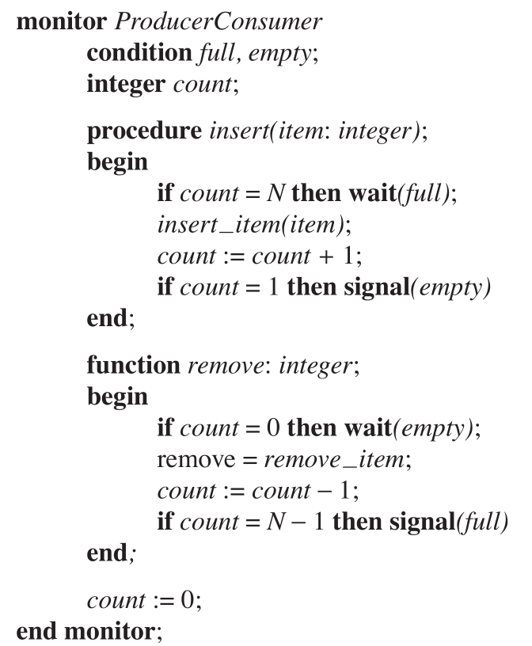
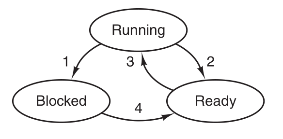

# Summary of Modern Operating System

知识点总结，可以用复习时检查完整度。

基于高海昌老师PPT。

## Processes and Threads

### Processes

> - process model
>   - What is process? consist of ?
> - process creation
>   - four events that cause process creation
>   - parent and children
>     - resource sharing(3 cases), execution(concurrently or not), address space
> - process termination
>   - four conditions that terminate process
>   - In what situation parent may terminate child processes.
> - process state
>   - new, running, blocked, ready, terminated
>   - diagram of process state(important)
>   - when to switch, context switch
> - implementation of process
>   - main: PCB

### Threads

> - Thread model
>
>   - what is thread? consist of? properties?
>   - what items are shared between threads, what are ***private*** to each other?
>
> - Implementing threads
>
>   - three mechanism(kernel space, user space, hybrid)
>
> - Scheduling
>
>   
>
>   

## Deadlock

> - Definition and types of resource 
> - Deadlock 
>   - definition 定义
>   - four conditions for deadlock 
>   - strategies dealing with deadlock 
>     - esp. detection and recovery 
> - Recovery from deadlock 
>   - preemption, rollback, killing processes
> - Deadlock avoidance
>   - safe state, Banker's Algorithm
> - Deadlock prevention
>   - attacking four conditions for deadlock
> - Starvation

## Memory Management

### Basics

> - properties of ideal memory: large, fast, non-vonlatile
> - Memory hierarchy: cache, main memory, disk storage
> - I/O and CPU utilization（考点之一）
> - relocation and protection
> - base limit regitster

### Swapping

> - What is swapping? What's the difference between swapping and virtual memory
> - When will memory allocation change? (process comes in and leave the memory)
> - memory management with bitmap & list
> - algorithms used to allocate memory for newly created process
>   - first fit, next fit, worst fit, best fit, quick fit.

### virtual memory

**The basic idea behind virtual memory is that the combined size of the program, data, and stack may exceed the amount of physical memory available for it.**

**The operating system keeps those parts of the program currently in use in main memory, and the rest on the disk.**

#### paging

> - MMU
> - How do we convert virtual address to physical memory address? (Usage of MMU)
>
> 
>
> - What is page, page frame, page fault?
>
>   - The virtual address space is divided up into units called **pages**.
>   - The corresponding units in the physical memory are called **page frames**.
>   - When MMU notices that the page is unmapped  and causes the CPU to trap to the operating system. This trap is called a **page fault**
>
> - How is page table used ?
>
>   
>
> - Page table entry
>
>   
>
> - 

## Input and Output

### I/O

> - I/O device
>
>   - main function (send commands, catch interrupts, handle errors, provide an interface)
>   - category: block device, character device 
>   - device independence
>
> - I/O device components
>
>   - mechanical component
>   - electronic component (control the device)
>     - convert serial bit stream into a block of bytes
>     - Perform error correction
>     - copy data to main memory
>   - registers and buffer
>
> - I/O and Memory
>
>   - separated I/O and memory space
>   - memory-mapped I/O (important)
>     - Advantages: written entirely in C; no special protection needed; simple instruction
>     - disadvantages: 多数电脑有caching机制，control register数据内容不实时；
>   - hybrid: memory-mapped I/O buffers, separate I/O ports for the control registers.
>
> - DMA (important)
>
>   
>
> - interrupt
>
> - I/O software
>
>   - Goals: device independence, uniform naming, error handling, syn & asyn transfer, buffering, sharable & dedicated
>
> - Three ways to perform I/O (important, pay attention to pro&cons)
>
>   - programed I/O
>   - interrupt-driven I/O
>   - I/O using DMA
>
> - I/O software layers
>
>   

### Disk

> - Disks
>   - category: optical disk, magnetic disk, SSD
>   - component: cylinder, track, sector
>   - RAID(Redundant Array of Independent Disk), 独立磁盘冗余阵列
> - CD-ROM原理
> - Disk Formatting
>   - disk sector consists of preamble, data, ECC
>   - cylinder skew
>   - interleaving
> - Disk Arm Scheduling Algorithm (important)
>   - FCFS,  shortest seek first, the elevator algorithm
>   - error handling
> -  SSD
> - Clock
>   - traditional clock(low frequency), programmable clock (high frequency, flexible)

## Essay questions prediction

> - ***What is TLB, what role does it play in memory management?*** （往年题）
>   
>   - TLB is translation lookaside buffer, a small hardware device for mapping virtual addresses to physical addresses without going through the page table. It's usually inside the MMU and consists of a small number of  entries containing information about the page, like virtual page number, modification bit, protection bit, reference bit and so on.
>   - In memory management, it speeds up paging(mapping virtual addresses to physical addresses).
>   
> - What is system call? Use an example to illustrate the steps of system call. （往年题）
>
>   - System call is an interface between a process and operating system to allow user-level processes to request kernel services from the operating system.
>
>   - Example: the system call read(fd, buffer, nbytes).
>
>     1. Push the parameters onto the stack. (In the order of nbytes, &buffer, fd).
>     2. Call library procedure.
>     3. Library procedure put the system-call number in the register.
>     4. ***Execute a TRAP instruction to switch from user mode to kernel mode (and start execution within the kernel).***
>     5. (Examine the system-call number and) dispatch to the correct system-call handler.
>     6. System-call handler runs.
>     7. ***Control return to user-space library procedure (following the TRAP instruction).***
>     8. Procedure returns to the user program like usual procedure calls.
>     9. Clean up the stack and increment SP(Stack pointer).     
>   
> - What is monitor? Can you use monitor to implement a data structure? （往年题）
>
>   - **A monitor** is a collection of procedures, variables, and data structures that are all grouped together in a special kind of module or package. (via PPT chp2-2 slide27)
>   - shown below
>     
>
> - Please describe the diagram of Process State.（往年题）
>
>   - 
>
>   - Running (actually using the CPU at that instant).
>
>     Ready (runnable; temporarily stopped to let another process run).
>
>     Blocked (unable to run until some external event happens).
>
>   - 1.  occurs when the operating system discovers that a process cannot continue right now, such as process blocks for input.
>     2. occurs when the scheduler decides that the running process has run long enough and picks another process.
>     3. occurs when all other processes had their fair share and the scheduler picks this process
>     4. occurs when the external event for which a process was waiting (such as the arrival of  input)
>   
> - The difference of Programmed I/O and Interrupt-driven I/O? （往年题）
>
>   - In programmed I/O, CPU does all the work, it continuesly polls the status register of the device during the whole I/O (Polling) .
>   - In interrupt-driven I/O, it allows CPU to do something else while waiting for the device is not ready for I/O. If the device is ready for I/O, an interrupt is generated to block the current running process and CPU switches back to I/O.
>
> - What the function of the operating system?
>
>   Two main functions of the operating : providing abstractions to user programs and managing the computer's both hardware and software resources.
>
> - What is process, what is thread,  what the difference between them?
>
>   - a process is an executing program, including the current value of the program counter, register and variables.
>  - a thread (or a light-weighted process) is the basic unit of CPU utilization consists of program counter, register set and stack space.
>   - difference:（from 王道操作系统）
>     - 调度方面。在引入线程的操作系统中，线程是独立调度的基本单位，进程是拥有资源的基本单位。
>     - 系统开销方面。由于创建或撤销进程时，系统都要为之分配或回收资源，如内存空间、I/O设备等很大，而线程切换只需要保存和设置少量寄存器内容，开销很小。
>     - 地址空间和其他资源方面。不同进程的地址空间之间互相独立，而同一进程的各线程间共享进程的资源。
>     - 通信方面。IPC需要进程同步和互斥来保持数据一致性，而线程间可以直接读/写进程数据段来进行通信。
> 
> - On all current computers, at least part of the interrupt handlers are written in assembly language. Why?(原书课后题)
>
>   ​		Generally, high-level languages do not allow the kind of access to CPU hard-ware that is required. For instance, an interrupt handler may be required to enable and disable the interrupt servicing a particular device, or to manipulate data within a process’ stack area. Also, interrupt service routines must execute
>  as rapidly as possible. （原书参考答案）
> 
>   

