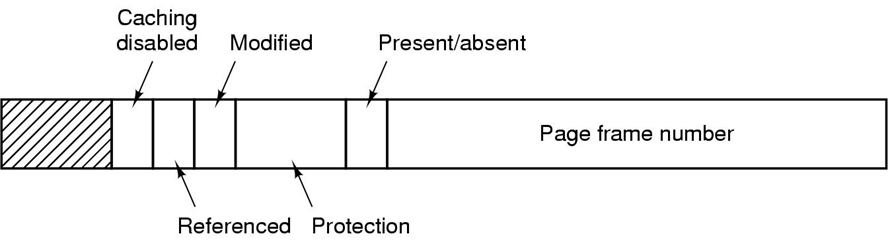
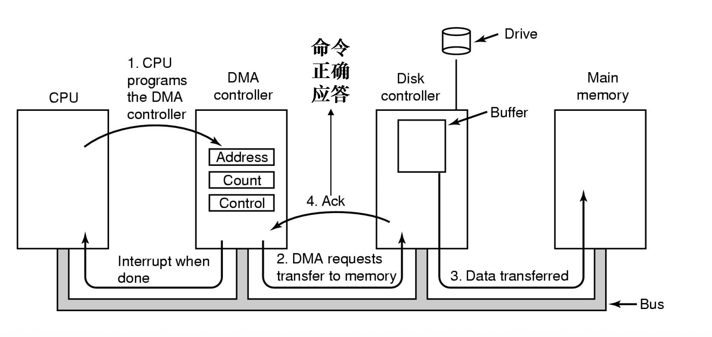

# Summary of Modern Operating System

知识点总结，可以用复习时检查完整度。

## Processes and Threads

### Processes

> - process model
>   - What is process? consist of ?
> - process creation
>   - four events that cause process creation
>   - resource sharing(3 cases), execution(concurrently or not), address space
> - process termination
>   - four conditions that terminate process
>   - In what situation parent may terminate child processes.
> - process state
>   - new, running, blocked, ready, terminated
>   - diagram of process state(important)
>   - when to switch, context switch
> - implementation of process
>   - main: PCB

### Threads

> - Thread model
>
>   - what is thread? consist of? properties?
>   - what items are shared between threads, what are ***private*** to each other?
>
> - Implementing threads
>
>   - three mechanism(kernel space, user space, hybrid)
>
> - Scheduling
>
>   
>
>   

## Deadlock

> - Definition and types of resource 
> - Deadlock 
>   - definition 定义
>   - four conditions for deadlock 
>   - strategies dealing with deadlock 
>     - esp. detection and recovery 
> - Recovery from deadlock 
>   - preemption, rollback, killing processes
> - Deadlock avoidance
>   - safe state, Banker's Algorithm
> - Deadlock prevention
>   - attacking four conditions for deadlock
> - Starvation

## Memory Management

### Basics

> - properties of ideal memory: large, fast, non-vonlatile
> - Memory hierarchy: cache, main memory, disk storage
> - I/O and CPU utilization（考点之一）
> - relocation and protection
> - base limit regitster

### Swapping

> - What is swapping? What's the difference between swapping and virtual memory
> - When will memory allocation change? (process comes in and leave the memory)
> - memory management with bitmap & list
> - algorithms used to allocate memory for newly created process
>   - first fit, next fit, worst fit, best fit, quick fit.

### virtual memory

**The basic idea behind virtual memory is that the combined size of the program, data, and stack may exceed the amount of physical memory available for it.**

**The operating system keeps those parts of the program currently in use in main memory, and the rest on the disk.**

#### paging

> - MMU
> - How do we convert virtual address to physical memory address? (Usage of MMU)
>
> 
>
> - What is page, page frame, page fault?
>
>   - The virtual address space is divided up into units called **pages**.
>   - The corresponding units in the physical memory are called **page frames**.
>   - When MMU notices that the page is unmapped  and causes the CPU to trap to the operating system. This trap is called a **page fault**
>
> - How is page table used ?
>
>   
>
> - Page table entry
>
>   
>
> - 

## Input and Output

### I/O

> - I/O device
>
>   - main function (send commands, catch interrupts, handle errors, provide an interface)
>   - category: block device, character device 
>   - device independence
>
> - I/O device components
>
>   - mechanical component
>   - electronic component (control the device)
>     - convert serial bit stream into a block of bytes
>     - Perform error correction
>     - copy data to main memory
>   - registers and buffer
>
> - I/O and Memory
>
>   - separated I/O and memory space
>   - memory-mapped I/O (important)
>     - Advantages: written entirely in C; no special protection needed; simple instruction
>     - disadvantages: 多数电脑有caching机制，control register数据内容不实时；
>   - hybrid: memory-mapped I/O buffers, separate I/O ports for the control registers.
>
> - DMA (important)
>
>   
>
> - interrupt
>
> - I/O software
>
>   - Goals: device independence, uniform naming, error handling, syn & asyn transfer, buffering, sharable & dedicated
>
> - Three ways to perform I/O (important, pay attention to pro&cons)
>
>   - programed I/O
>   - interrupt-driven I/O
>   - I/O using DMA
>
> - I/O software layers
>
>   

### Disk

> - Disks
>   - category: optical disk, magnetic disk, SSD
>   - component: cylinder, track, sector
>   - RAID(Redundant Array of Independent Disk), 独立磁盘冗余阵列
> - CD-ROM原理
> - Disk Formatting
>   - disk sector consists of preamble, data, ECC
>   - cylinder skew
>   - interleaving
> - Disk Arm Scheduling Algorithm (important)
>   - FCFS,  shortest seek first, the elevator algorithm
>   - error handling
> -  SSD
> - Clock
>   - traditional clock(low frequency), programmable clock (high frequency, flexible)

## Short-answer questions

> - ***What is TLB, what role does it play in memory management?***
    - TLB is translation lookaside buffer, a small hardware device for mapping virtual addresses to physical addresses without going through the page table. It's usually inside the MMU and consists of a small number of  entries containing information about the page, like virtual page number, modification bit, protection bit, reference bit and so on.
    - In memory management, it speeds up paging.

