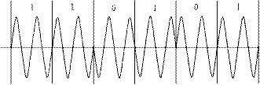
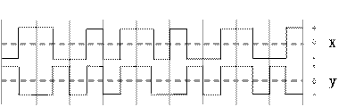
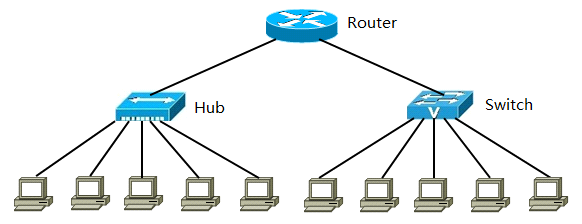
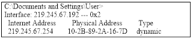
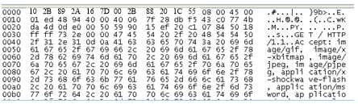

==Summarized by Levick Cheng. For reference only.==

Contents came from Prof. YTH.

## Test 1

**一 填空**

1．非对称数字用户线（ADSL）采用的多路复用技术是 `________`。

>  FDM（频分多路复用）。
>
> ADSL采用的是FDM（频分多路复用技术）

2．在相隔2000km的两地间通过电缆以4800b/s的速率传送3000比特长的数据包，从开始发送到接收完数据需要的时间是`________`，如果用50 Kb/s的卫星信道传送，则需要的时间是 `________`。

> $T=\dfrac{3000}{4800}+\dfrac{2000k}{3\times 10^{8}\times \dfrac{2}{3}}=635\ ms$（传输时间+传播时间）
>
> $T_{satellite}=\dfrac{3000}{4800}+270=330\ ms$,卫星传输有固定270ms延时（传输时间+传播延时）

3．8个9600b/s的信道按时分多路复用在一条线路上传输，在统计TDM情况下，假定每个子信道有80％的时间忙，复用线路的控制开销为5％，那么复用线路的带宽为`________`。

>  $B=(9600\times80\%)\times8\div (1-5\%)=64.637kbps$

4．E1载波把32个信道按`________`方式复用在一条2.048Mb/s的高速信道上，每条话音信道的数据速率是`________`，该基本帧的传送时间为`________`。

> TDM
>
> 64kb /s
>
> 125us

5．贝尔系统T3信道的数据速率大约是`________`Mb/s。

> 44.736 Mb/s

6．下图所示的调制方式是`________`，若载波频率为2400Hz，则码元速率为`________`。

> DPSK
>
> $r=2,S=\dfrac{n}{r}=1200\ baud$

7．设信道带宽为3400Hz，采用PCM编码，采样周期为125μs，每个样本量化为128个等级，则信道的数据速率为`________`。

> $r=log_{2}128=7,Sampling\ rate=\dfrac{1}{125us}=8k\ sample/s,N=7\times8k=56k\ bps$
>
> 此处信号带宽为干扰项。如果没给出采样周期(采样率)，那采样率应该至少是两倍带宽。

8．假设模拟信号的最高频率为5MHz，采样频率必须大于`________`，才能使得到的样本信号不失真，如果每个样本量化为256个等级，则传输的数据速率是`________`。

> 10MHz
>
> $N=10M\times log_{2}256=80MHz$

9．在异步通信中，每个字符包含1位起始位、7位数据位、1位奇偶位和2位终止位，若每秒钟传送100个字符，采用4相相位调制，则码元速率为`________`，有效数据速率为`________`。

> $r=log_{2}4=2,N=(1+7+1+2)\times 100=1100\ bps,N_{有效}=\dfrac{7}{1+7+1+2}\times N=700\ bps,S=\dfrac{N}{2}=550\ baud$

 

**二 选择题**

● 下图表示了某个数据的两种编码，这两种编码分别是 （1）`________`，该数据是 （2）`________`。

 

（1）A. X为差分曼彻斯特码，Y为曼彻斯特码

B. X为差分曼彻斯特码，Y为双极性码

C. X为曼彻斯特码，Y为差分曼彻斯特码

D. X为曼彻斯特码，Y为不归零码 

（2）A. 010011110              B. 010011010           

C. 011011010              D. 010010010

> 排除法
>
> (1)C
>
> (2)B

●最大传输速率能达到100Mb/s的双绞线是 （3）`________`。

（3）A. CAT3     B. CAT4        C. CAT5        D. CAT6

> C

● 光纤分为单模光纤与多模光纤，这两种光纤的区别是 （4）`________`。

（4）A. 单模光纤的纤芯大，多模光纤的纤芯小

B. 单模光纤比多模光纤采用的波长长

C. 单模光纤的传输频带窄，而多模光纤的传输频带宽

D. 单模光纤的光源采用发光二极管（Light Emitting Diode），而多模光纤的光源采用激光二极管（Laser Diode）   

> B.
>
> A.单模光纤的纤芯小，多模光纤的纤芯大。
>
> C.单模光纤的传输频带宽，而多模光纤的传输频带窄
>
> D.单模光纤的光源采用激光二极管（Laser Diode)，而多模光纤的光源采用发光二极管（Light Emitting Diode).
>
> ACD均说反。答案选B。

● 关于曼彻斯特编码，下面叙述中错误的是（5）`________`。

（5）A. 曼彻斯特编码是一种双相码

B. 采用曼彻斯特编码，波特率是数据速率的2倍

C. 曼彻斯特编码可以自同步

D. 曼彻斯特编码效率高

> D.曼彻斯特编码$r=\dfrac{1}{2}$，每两个signal element才能编码一个data element，编码效率低。其他都正确。

 

● 设信道带宽为3400Hz，调制为4种不同的码元，理想信道的数据速率为 （6）`________`kbps。

（6）A.3.4     B. 6.8          C. 13.6         D. 34

> $N=2\times B\times log_{2}4=13.6$,选C。

 

● 100BASE-FX采用4B/5B和NRZ-I编码，这种编码方式的效率为 （7）`________`。

（7）A. 50％        B. 60％        C. 80％         D. 100％

> 4B/5B是用5位表示4位编码来制造冗余（redundancy），以改善同步问题（synchronization）。效率=4/5=80%

● 下图所示是一种 （8）`________`调制方式。

（8）A. ASK       B. FSK         C. PSK         D. DPSK

> C.

●下面的网络中，属于电路交换网络的是 （9）`________`，属于分组交换网络的是 （10）`________`。

（9）A. VPN    B. PSTN        C. FRN         D. PPP

（10）A. VPN       B. PSTN        C. FRN         D. PPP

> B. PSTN  公共电话交换网络。
>
> C. FRN   **Frame Relay** is a standardized [wide area network](https://en.wikipedia.org/wiki/Wide_area_network) technology that specifies the [physical](https://en.wikipedia.org/wiki/Physical_layer) and [data link layers](https://en.wikipedia.org/wiki/Data_link_layer) of digital telecommunications channels using a [packet switching](https://en.wikipedia.org/wiki/Packet_switching) methodology.（来自wiki，百度百科有错误）

三 计算

Consider the transfer of a file containing one million 8-bits characters from one station to another. What is the total elapsed time and effective throughput for the following case: A local network with two stations a distance **D** apart, a data rate of **B** bps, and a frame size of **P** with **80** bits of overhead per frame. Each frame is acknowledged with an **88-bit frame** before the next is sent. The propagation speed on the bus is 200 m/us. Solve for:

(1) D = 1 km, B=1 Mbps, P= 256 bits.

(2) D=10 km, B=1 Mbps, P=256 bits

(3) D=1 km, B=50 Mbps, P=10,000 bits

> total elapsed time: 总耗时（这里指传输 1m 8-bits 字符所需总时间）
>
> **effective throughput**——the number of bits per second successfully delivered from source to destination for an individual data flow
>
> We define:
>
> $T_p:propagation\ \  time$
>
> $T_a:ACK\ \ packet\ \ transmission\ \ time$
>
> $T_d:data\ \ packet\ \ transmission\ \ time$
>
> $T:total\ \ elapsed\ \ time$
>
> $C:cycle\ \ time(time\ \ required\ \ per\ \ frame)$
>
> $T_e:effective\ \  throughput$
>
> $Q:data\ \ bits\ \ per\ \ packet$
>
> $N:total\ \ number\ \ frames\ \ we\ \ send$
>
> Then we have:
>
> $C=T_a+T_d+2\times T_p$
>
> $N=\dfrac{1M\times 8}{Q}$
>
> $T_d=\dfrac{P}{B}$
>
> $T_a=\dfrac{88}{B}$
>
> $T_p=\dfrac{D}{200m/us}$
>
> Q=P-80
>
> $T_e=\dfrac{Q}{C}$
>
> $T=N\times C$
>
> From the equatinos above we have:
>
> (1):C=354 us, T=16.09 s, $T_e=497.18\ \ kbps$
>
> (2):C=444 us, T=20.18 s, $T_e=396.40\ \ kbps$
>
> (3):C=211.76 us,T=0.171 s, $T_s=46.86\ \ Mbps$

## Test 2

●  In Sliding-Window flow control techniques; there have 7 bits sequence number, so maximum windows size is （1） . 

**A．127**    B． 128       C．64         D． 1

> A. 2^7-1=127

● According to HDLC, RR5 means （2）   

A．the destination has received frame 1,2,3,4,5

 B．the destination has received frame 1,2,3,4 and waiting for No.5 frame

 C．the destination is waiting for No.5 frame

 D．the destination is waiting for Next 5 frames

> B.

● HDLC uses  （3）  frame to establish a logical connection.

> **U**. HDLC uses U-frame (un-numbered frame) to administrate the connection.
>
> **I-frames** are used to data-link user data and control information relating to user data (piggy-backing). 
>
> **S-frames** are used only to transport control information. (RR, RNR, SRJ, REJ)
>
> **U-frames** are reserved for system management. Information carried by U-frames is intended for managing the link itself

● In Ethernet different devices are distinguished by  （4）  addresses.

A. LLC              **B. MAC**             C. IP                    D. IPX

> B. Mac address.

● When a host moves from one network to another, which of the following is true： （5）  

A. IP address and MAC address must be changed

B. IP address must be changed but MAC address needn’t

C. MAC address must be changed but IP address needn’t

D. Neither needs to be changed 

> B.

● Which of the following LAN uses CSMA/CD protocol? （6）

A. Token ring         B. FDDI             C. Ethernet           D. Novell

> C.
>
> Ethernet(802.3) users CSMA/CD, WLAN(802.11) uses CSMA/CA.

●网络中存在各种交换设备，下面的说法中错误的是 （7） 。

（7）A. 以太网交换机根据MAC地址进行交换

B. 帧中继交换机只能根据虚电路号DLCI进行交换

C. 三层交换机只能根据第三层协议进行交换

D. ATM交换机根据虚电路标识进行信元交换

> C. 第三层&第二层均可。

●下面关于交换机的说法中，正确的是 （8） 。

A. 以太网交换机可以连接运行不同网络层协议的网络

B. 从工作原理上讲，以太网交换机是一种多端口网桥

C. 集线器是一种特殊的交换机

D. 通过交换机连接的一组工作站形成一个冲突域

> 

● 在生成树协议（STP）中，收敛的定义是指 （9） 。

A．所有端口都转换到阻塞状态  

B．所有端口都转换到转发状态  

C．所有端口都处于转发状态或侦听状态                  

D．所有端口都处于转发状态或阻塞状态

> 

● 100BASE-TX交换机，一个端口通信的数据速率（全双工）最大可以达到 （10） 。

（10）A．25Mb/s     B．50Mb/s      C．100Mb/s     D.200Mb/s

 

● 快速以太网标准100BASE-FX采用的传输介质是 （11） 。

（11）A．同轴电缆                  B．无屏蔽双绞线     

C．CATV电缆                 D．光纤

 

● 路由器通常采用 （12） 连接以太网交换机。

（12）A．RJ-45端口                  B．Console端口 

C．异步串口                   D．高速同步串口

 

● In the network topology below, there are  （13）  broadcast domain(s) and  （14）   collision domain(s) in total.

A、2  B、3  C、4  D、5  E、6  F、7 

 

●在局域网标准中，100BASE-T规定从收发器到集线器的距离不超过（15）米。 

（15）A. 100       B. 185          C. 300          D. 1000

 

●一个以太网交换机，读取整个数据帧，对数据帧进行差错校验后再转发出去，这种交换方式称为 （16） 。

（16）A. 存储转发交换             B. 直通交换

C. 无碎片交换               D. 无差错交换

 

●以太网交换机的交换方式有三种，这三种交换方式不包括 （17） 。

（17）A. 存储转发式交换       B. IP交换

C. 直通式交换         D. 碎片过滤式交换

 

●以太网介质访问控制策略可以采用不同的监听算法，其中一种是：“一旦介质空闲就发送数据，假如介质忙，继续监听，直到介质空闲后立即发送数据”，这种算法称为（18）监听算法。这种算法的主要特点是 （18） 。 

（17）A. 1-坚持型                     B. 非坚持型         

C. P-坚持型                     D. 0-坚持型

（18）A. 介质利用率低，且冲突概率低  

B. 介质利用率高，但冲突概率也高

C. 介质利用率低，且无法避免冲突 

D. 介质利用率高，且可以有效避免冲突 

 

●以太网帧格式如下图所示，其中“填充”字段的作用是 （19） ，“长度”字段的作用是 （20） 。

| 前导字段 | 帧起始符 | 目的地址 | 源地址 | 长度 | 数据 | 填充 | 校验和 |
| -------- | -------- | -------- | ------ | ---- | ---- | ---- | ------ |
| 前导字段 | 帧起始符 | 目的地址 | 源地址 | 长度 | 数据 | 填充 | 校验和 |

（19）A. 可用于表示任选参数         B. 表示封装的上层协议

C. 表示控制帧的类型             D. 维持64字节的最小帧长 

（20）A. 表示数据字段的长度         

B. 表示封装的上层协议的类型

C. 表示整个帧的长度                 

D. 既可以表示数据字段长度也可以表示上层协议的类型 

 

●802.11在MAC层采用了（21） 协议，下面关于这个协议的描述中错误的是 （22） 。

（21）A. CSMA/CD                 B. CSMA/CA   

C. DQDB                     D. 令牌传递

（22）A. 各个发送站在两次帧间隔（IFS）之间进行竞争发送

B. 每一个发送站维持一个后退计数器并监听网络上的通信

C. 各个发送站按业务的优先级获得不同的发送机会          

D. 该协议适用于突发性业务

 

●IEEE 802.11之所以不采用CSMA/CD协议的原因是 （23） 。

（23）A. 采用协议的效率更高         B. 为了解决隐蔽终端问题

C. CSMA/CD协议的开销更大     D. 为了引进其他业务

 

●在无线局域网中，AP的作用是（24） 。

（24）A. 无线接入  B. 用户认证     C. 路由选择     D. 业务管理

 

● 假设有一个局域网，管理站每15分钟轮询被管理设备一次，一次查询访问需要的时间是200ms，则管理站最多可支持 （25） 个网络设备。          

（25）A．400       B．4000         C．4500         D．5000

 

●  （26） 用于VLAN之间的通信。

（26）A. 路由器     B. 网桥         C. 交换机       D. 集线器

 

●  A VLAN can be seen as a  （27）  .

A. conflict domain                         B. broadcast domain 

C. management domain                     D. blocking domain

 

 

● ARP协议用于查找IP地址对应的MAC地址，若主机hostA的MAC地址为aa-aa-aa-aa-aa-aa，主机hostB的MAC地址为bb-bb-bb-bb-bb-bb。

由hostA发出的查询hostB的MAC地址的帧格式如下图所示，则此帧中的目标MAC地址为 （28） ，ARP报文中的目标MAC地址为 （29） 。 

| 目标MAC地址 | 源MAC地址 | 协议类型 | ARP报文 | CRC  |
| ----------- | --------- | -------- | ------- | ---- |
|             |           |          |         |      |

（28）A．aa-aa-aa-aa-aa-aa           B．bb-bb-bb-bb-bb-bb       

C．00-00-00-00-00-00       D．ff-ff-ff-ff-ff-ff

（29）A．aa-aa-aa-aa-aa-aa           B．bb-bb-bb-bb-bb-bb       

C．00-00-00-00-00-00       D．ff-ff-ff-ff-ff-ff

 

●某用户正在Internet浏览网页，在Windows命令窗口中输入（30）命令后得到下图所示的结果。

若采用抓包器抓获某一报文的以太帧如下图所示，该报文是（31） 。

（30）A．arp –a     B．ipconfig /all  C．route    D. nslookup

（31）A．由本机发出的Web页面请求报文 

B．由Internet返回的Web响应报文

C．由本机发出的查找网关MAC地址的ARP报文

D．由Internet返回的ARP响应报文

 

 

 

\1. Assuming a new transmission medium is designed for Ethernet, and this new medium allows up to 6 repeaters between any two terminal systems. The maximum propagation delay of each network segment is 20μs. The data rate of the new medium is 10Mb/s. Ignore the delay of the repeater, what is the minimum frame length? (6 points)

​    由于任意两个端系统最多有6个转发器，因此端系统间最多有7个网段。每个网段的最大传播延迟为20微秒，因此该以太网的最大端到端传播延迟为7×20微秒。 为了保证冲突检测机制能够正常使用，要求：帧的传输延迟≥帧的往返传播延迟，所以最小帧长为2×7×20×10=2800bit

\2. Consider a LAN of length 1km with a data rate of 10Mbps, and the propagation speed on the bus is 200m/μs. The length of data frame is 512 bits, including 32 bits of the overhead. The receiver will transmit 32 bits of acknowledgement frame after the successful transmission. After receiving the acknowledgement, transmitter send next frame. If there is no conflict, what is the effective data rate? (8 points)

1)发送数据帧512bit所需时间= 512bit/10Mbps=51.2 μs 
 数据帧在信道上的传播时间= 1km/(200m/ μs )=5 μs 
 共用时间= 51.2 μs +5 μs =56.2 μs 

2)回发确认帧32bit所需时间= 32bit/10Mbps=3.2 μs 
 确认帧在信道上的传播时间= 1km/(200m/ μs )=5 μs 
 共用时间= 3.2 μs +5 μs =8.2 μs 
 故有效数据传输速率为：(512-32)bit/(56.2+8.2) μs =7.45Mbps

 

3．Suppose the input data is 11111100001010 and it’s Polynomials(生成多项式)G(X)=X5 +X2＋X+1, gives out it’s CRC check code.(要求给出计算过程) (4 points)

 

 