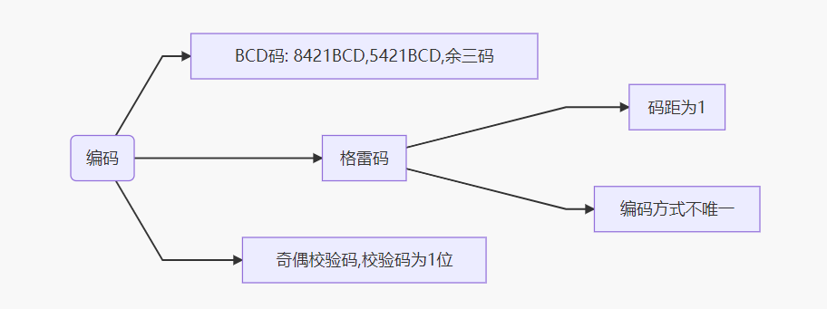

# 软工数电考点总结

​	本文无题目，仅提供知识点参考。文中课本为《数字电子技术》（第四版），江晓安，2015年2月第四版。

## 第一章

>   - 数制转换（包括整数和小数）
>
>    - 10、2、8、16进制相互转换
>
>    - 特别的，对于整数：短除后倒序余数；小数：乘以2后与1比较，大得1，小上0，结果为1时停止。
>      （见课本P4）
>
>  - 编码
>
>    
>
>    注意8421BCD码与余三码的转换。
>
>    练习见课本P10-11课后题。

## 第二章

> 常用逻辑函数、逻辑门的功能及其表示
>
> - 表达式、真值表、逻辑门符号、波形
>
> Here  is the graph.
>
> 集成逻辑门
>
> - 基本概念
> - oc门和三态门的功能。（例题，作业）
>   - oc门逻辑门符号，使用（并联时需要上拉电阻与直流电源），作用：线与
>   - 三态门 逻辑门符号，功能：三态（使能端有效则工作，否则为高阻态）

## 第三章

> ***基本公式和法则***
>
> - 公式：分配律，吸收律（3个），多余项定律，求反律（摩根定律）
> - 法则：代入法则（等式中变量由函数代替仍成立），对偶法则（+换成●，●换成+，0变成1，1变成0），反演法则（摩根定律）
>
> ***基本公式的应用***
>
> - **逻辑函数不同形式的转换（与或，与非，或非，或与，与或非）**，逻辑函数化简（基本公式的应用），证明等式成立
>   
>   - 与非式：F两次求反并运用一次摩根定律
>   - 或与式：$\overline{F}$(与或形式)一次求反，运用摩根定律
>   - 或非式：或与式两次求反，运用一次摩根定律
>   - 与或非式：$\overline{F}$一次求反（不适用摩根定律）
>   
>   卡诺图进行逻辑形式化简与此相似。
>
> **逻辑函数代数法化简（卡诺图）**
>
> - 最小项(最小项标准式，一般式，性质)，最小项表达式概念（需要十分清楚）
> - **<u>*卡诺图与卡诺图化简（全书最重要知识点之一）*</u>**
>   - 相邻项的概念，如何在卡诺图中找相邻项（几何相邻，包括直接相邻、相对相接、相重）
>   - 能够画出给出函数的卡诺图
>   - 能够用卡诺图法将函数化简成最简xx式（与非，或非，与或，或与，与或非）
>   - **完全描述逻辑函数和非完全描述逻辑函数**
>   - 注意变量标注采用循环码

第三章之后主要是对前面所学知识的整合应用。

## 第四章

> - 全（半）加器（和全减器）真值表，S和Ci+1的表达式
> - 三八译码器和数据选择器（重点，常考分析和设计题）
>   - 逻辑符号
>   - 功能表
>   - 常见题型应用
> - 竞争和冒险（一般不考）
>   - 偏“1”冒险
>   - 偏“0”冒险
>   - 冒险的判别和消除

## 第五章

> - 时序电路的概念（特点，分类）
> - 状态图，状态真值表
> - 基本触发器（熟悉逻辑符号,）
>   - 钟控RS触发器
>   - D触发器
>   - T触发器（常考选择或填空）
>   - JK触发器（常考大题）

## 第六章

> - 同步时序电路分析
>   - 同步or 异步
>   - 激励函数，特征方程，状态方程
>   - 列状态真值表&状态转移图
>   - 功能描述
> - 同步时序电路设计
>   - 建立状态图
>   - 状态化简
>   - 状态分配
>   - 确定激励方程和输出方程。
>   - 画逻辑图
> - 计数器
>   - 74LS90二-五-十进制计数器
>   - 74LS161同步四位二进制计数器
> - 位移寄存器
>   - 74LS194位移寄存器
>     - 环形&扭环形计数器（奇数分频器，偶数分频器）
> - 序列信号发生器
>   - 位移型
>   - 计数型
>     - 译码器实现
>     - 数据选择器实现

## 具体考试题型、考点和重点题型

题型

选择 15 * 2
填空 10 * 2
分析 10 * 3
设计 10 * 3

选择范围：主要 Chapter 1~3，会涉及 5、6 基本概念
填空范围：主要 Ch 1、2、6

分析范围：组合逻辑分析（数据选择器）、计数器（161 / 90 二考一）、161 串 38

设计：Ch 4、6，组合逻辑设计（数据选择、3-8，例如设计全加器或实现逻辑函数）、161 / 90（和分析考点相对，例如设计给定起始状态的计数器）、JK 设计（需要会在给定状态迁移图 / 表的时候画另一个，画出电路图，注意上升下降、CP）

课后习题
Ch1：4、5、6、7、10、11、12、13

Ch2：异或/同或性质、OC 门（线与，菱形）、三态门（倒三角，控制端，高阻态）。习题：1、2、4

Ch3：布尔代数（表 3-1，吸收律；对偶、求反）、卡诺图（eg 给定逻辑函数写最小项 expr，逻辑相邻项）、化简（形式转换）、无关 / 多余 / 任意 / 禁止项（都是一个东西，例 31）。习题：例 27、28、30、31；练 3（**必做**）、6、7、8、9

Ch4：分析设计、全加器、编码、译码、数据选择器（四选一 / 八选一，应用）、竞争冒险（概念、从卡诺图看）。
习题：例 3、5、6、7、8、14、16、20、21、22、23；练 11、19、21、24、25、29

Ch5：时序电路特点（状态图 / 表 / 真值表）、触发器特点性质、状态方程（填空必考）、空翻震荡（填空）
习题：6、7

Ch6：分频器（输出信号频率是输入信号频率的 1/n）、计数器、寄存器（环形、扭环形）、序列信号发生器
习题：例 5、7、8、9、15、16；练 7、8、9、11、14、16、20；分析图 6-66（迁移图、输出序列）

