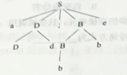
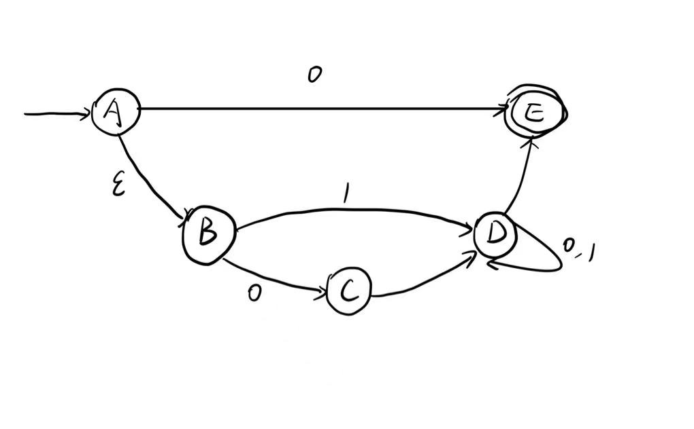
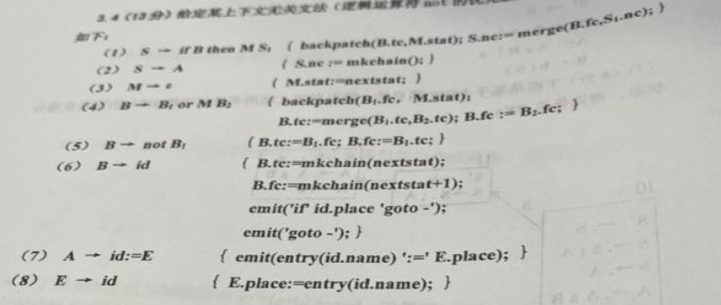

# 1.单选题

1.1 在以阶段划分的编译器中，()阶段以上一阶段识别的()为输入，识别句子结构并构造相应()，将之交给()阶段。
A. 词法分析、记号流、语法树、语法分析
B. 语法分析、记号流、语法树、语义分析
C. 词法分析、语法树、记号流、语法分析
D. 语法分析、语法树、记号流、语义分析

1.2 编译器与解释器是语言翻译的两种基本形态，其中编译器的工作方式为
其特点包括
A. 边翻译边执行、程序执行效率低且可移植性差
B. 先翻译后执行、程序执行效率高且可移植性好
C. 边翻译边执行、程序执行效率低且可移植性好
D. 先翻译后执行、程序执行效率高且可移植性差

1.3 设正规式R{by,byb}，正规式S表示{hx}则正规式RS?表示的集合是
A. (byhx, bybhx)	B. {by, byb, byhx, bybhx}
C. (by, byb, byhx)	D. (by, byb, bybhx)

1.4 NFA的不确定性表现在

(1) 存在空转移

(2) 同一状态下对同一字符有多于一个的下一状态转移

(3) 存在多个终态

A(1)	B(2)	C(1)(2)	D(1)(2)(3)

1.5 在基于递归下降子程序的语法分析器中，每个产生式对应一个子程序，在子程序内部，产生式右部的非终结符对应()，终结符对应()

A 匹配输入中的记号、子程序调用

B 子程序调用、匹配输入中的记号

C 匹配输入中的记号、最左规约

D 最左规约 匹配输入中的记号

1.6 在文法$E\rightarrow T+E|T,T\rightarrow T*id | id$中，运算+比运算符*的优先级（），运算符+是（）结合的，运算符 *是()结合的。

A. 高 左 左

B 低 左 右

C 高 右 右

D 低 右 左

1.7 基于预测分析的语法分析器是对句子的

A 最右推导
B 最左推导
C 最左归约
D 最右规约

1.8 在基于移进-归约分析的语法分析器中，若分析栈的栈顶形成了句柄，且下一输入终结符属于对应非终结符的 FOLLOW集合，则执行()动作。
A 移进
B 规约
C 推导
D 匹配终结符

1.9 若在过程调用时，将作为实参的变量的地址放进形参的存储单元，且在被调用过程内对形参单元中的数据直接访问，则这种参数传递方式为
A.值调用
B.引用调用
C. 复写-恢复调用
D. 换名调用

1.10在语法制导翻译的过程中，对于可执行语句的主要处理目标为
A. 填写符号表			B.生成中间代码
C. 分析句子结构		D.计算执行结果

# 2.简答题

## 2.1

$$
Uchar = [A-Z] \\
Lchar = [a-z] \\
Digit = [0-9]
$$

(1)用正规式描述“以大写英文字母打头，由英文字母、数字构成的字符串”这个集合

(2) 给出上述正规式可表示的三个不同字符串

## 2.2

文法G
$$
E \rightarrow E or E | E and E | id
$$
(1)以句子a or b and c 为例说明该文法是二义的

(2)将该二义文法改造成非二义文法

## 2.3

某句型的分析树如下，请给出该句型的全部短语、直接短语和句柄

## 2.4

对于术表达式及赋值语x:=(a+b)*-c+d，运算符+(加)、(乘)、-(取负)的优先级与结合性与常规相同，请分别给出其语法树和后缀式。

## 2.5

简要说明传值调用和引用调用的区别，并分别给出两种方式在下面代码的输出结果

~~~pascal
program main(input, output)
	procedure foo(x, y)
	begin
		x := x + y
		y := y - x + 10
	end;
	begin
		a := 2; b := 5;
		foo(a,b);
		print(a, b);
	end;
~~~

# 3.计算题

## 3.1

（1）给出三个该NFA可识别的字符串

（2）确定化为DFA D，给出D的状态转移图

（3） 判断D是否为最小DFA，若不是，找出其最小DFA D'并给出其状态转换图

## 3.2

文法G
$$
S \rightarrow AB \\
A \rightarrow a | \epsilon
B \rightarrow c | Bb
$$
(1) 求解 FIRST集合 FOLLOW集合

|      | FIRST集合 | FOLLOW集合 |
| ---- | --------- | ---------- |
| S    |           |            |
| A    |           |            |
| B    |           |            |

(2)构造该文法的预测分析表

|      | a    | b    | c    | #    |
| ---- | ---- | ---- | ---- | ---- |
| S    |      |      |      |      |
| A    |      |      |      |      |
| B    |      |      |      |      |

(3)改写成等价的LL(1)文法

## 3.3

增广文法G'
$$
S' \rightarrow S \\
S \rightarrow S;A |A \\
A \rightarrow AaB | a
B \rightarrow b(S)
$$
(1)构建项目集

(2)文法G是否为SLR(1)文法？为什么？

## 3.4

某上下文无关文法的翻译方案如下：

对于语句if not a or b then x:=c

(1) 给出其注释分析树

(2) 设nextstat的初值为1，根据上述翻译方案，给出该语句的三地址码序列