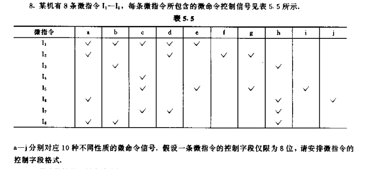

# 计组2020年期末题回忆版

##第一部分: 
简答题,总共7条,任选其中6条作答.每条7分.总计42分

1.不同编码的转换（原码反码补码），真值乘除2后的机器数。具体题目参考习题2.2与习题2.4。

2.给定指令格式求指令条数（在课后题4.4的基础上加上了空指令条数，求单指令条数）。

3.寻址方式，类似习题4.10，在其基础上增加了LEA 指令。

4.规格化浮点数求范围（最大最小），类似课后题2.21

5.简述RISC特点

6.习题5.13（原题）

7.简述冯诺依曼计算机体系架构

## 第二部分

1.运算,18分，浮点数布斯乘法
PS:两位乘法不属于考点，了解即可

2.读汇编,15分
答案是统计缓冲区中偶数的个数并求平均值
往年一般是写实现简单功能的汇编程序
PS:不要光记指令，汇编代码的格式也要记一下。另外一些“冷门”指令需要了解，比如这次考了LEA， TEST等不常用指令。

3.写微指令流程，15分
写出双字指令OR [1500], AX的微指令流程。和课后习题差不多。

4.写微指令逻辑表达式，10分,有点类似下图。（此题没有讲过类似题型）

## 附加题

1. 5分
   将十进制数字转换为754格式(一共两个数字,一个无法精确转换一个溢出)
2.  5分
   写出反码与补码的转换关系并证明之,5分

课后题出题的概率非常大，也包括没有布置的课后题。
PS: 文中出现的“习题x.x”均在`instuctor_manual.md`文件中有答案。

今年卷子相对简单，挂科率28%。推荐看顾新的PPT。

written by 18级胡博,  modified by Levick.