[TOC]

来自顾新老师习题课，仅供同学们参考，请勿抄袭。侵删。

## 第一章：绪论

### 习题1.10

某500MHz计算机，执行标准测试程序，程序中的指令类型、数量及指令执行的平均周期数如下表1.3所示：

​             表1.3 题1.10所用表

| 指令类型 | 指令数量 | 指令执行周期数 |
| -------- | -------- | -------------- |
| 整数     | 50000    | 1              |
| 数据传送 | 80000    | 2              |
| 浮点     | 10000    | 4              |
| 控制传送 | 5000     | 2              |

 求该计算机的有郊CPI，MIPS及程序的执行时间。

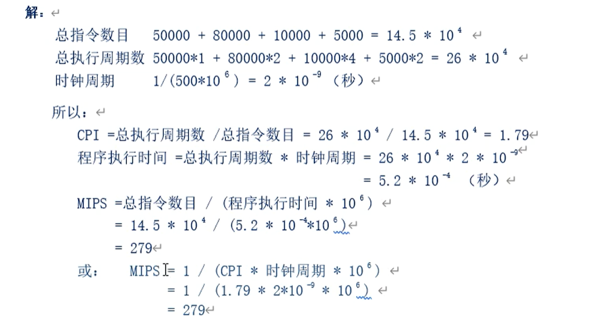

### 习题1.13

若计算机系统有三个部件a、b、c是可改进的，它们的部件加速比分别为30、30、20。若部件a和b在总执行时间中所占的比例分别是30％、30％。若要使整个系统的加速比达到10，部件c在总执行时间中所占的比例应为多少？

## 第二章：计算机中数据的表示

### 习题2.2 

 已知[*x*]原，求[*x*]补和[*x*]反。

① [*x*]原＝0.1010110          ② [*x*]原＝1.0010110

③ [*x*]原＝01010110           ④ [*x*]原＝11010010

### 习题2.4

假设机器字长为8位，求下列补码所对应*X*的十进制真值。

(1)   [2*X* ]补＝90H  

(2)    [1/2·*X* ]补＝C2H

(3)    [－*X* ]补＝FEH

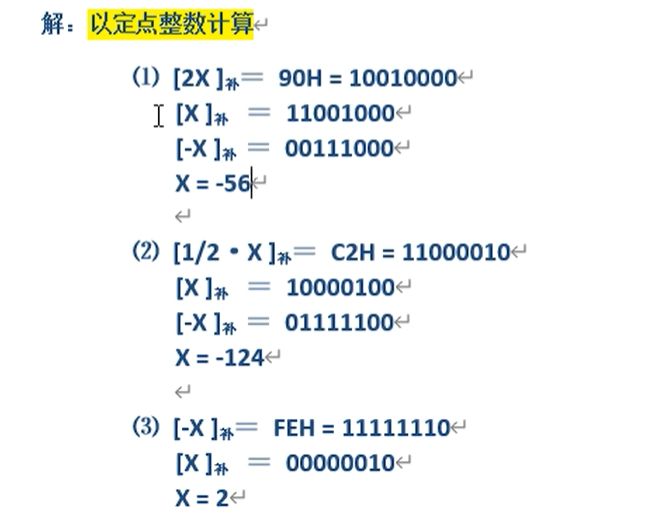

### 习题2.5   

设*x*为定点小数，[*x*]补＝1.*x*6 *x*5 *x*4 *x*3 *x*2 *x*1 *x*0 ，最高位为符号位。

(1)    若要*x* ＜-1/2，*x*6 *x*5 *x*4 *x*3 *x*2 *x*1 *x*0应满足什么条件？

(2)    若要-1/2≤*x* ＜-1/4，*x*6 *x*5 *x*4 *x*3 *x*2 *x*1 *x*0应满足什么条件？

补码大小比较可以根据其图形来进行观察。

补码机器数与真值对应关系表

### 习题2.9

若约定小数点在8位二进制数的最右端（定点整数），试分别写出下列各种情况下*W*、*X*、*Y*、*Z*的 真值。

(1)       [*W* ]补＝[*X* ]原＝[*Y* ]反＝[*Z* ]移＝00H

(2)       [*W* ]补＝[*X* ]原＝[*Y* ]反＝[*Z* ]移＝80H

(3)       [*W* ]补＝[*X* ]原＝[*Y* ]反＝[*Z* ]移＝FFH

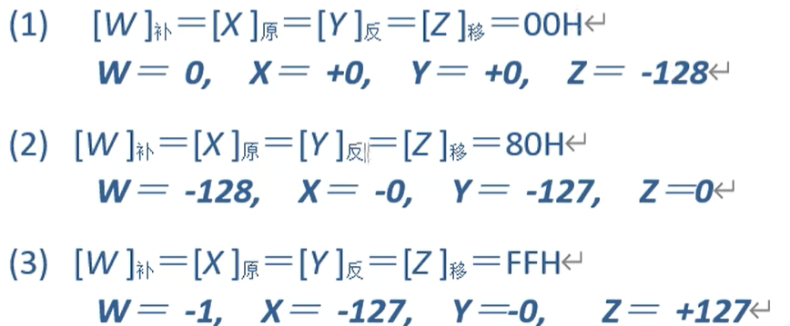

各编码方式在字长为8时机器数对应的定点整数真值如下图所示。

定点整数编码表

### 习题2.21

设浮点数字长16位，基值为2（以2为底）。其中阶码6位（含一位阶符），用移码表示；尾数10位（含一位数符），用补码表示。

(1)  求能表示的规格化浮点数的范围，填写下表，并与16位定点补码整数和定点补码小数的表示范围进行比较。

​                         表2.12 习题2.21附表

|          | 阶码码值（十六进制） | 尾数码值（十六进制） | 真值（十进制） |
| -------- | -------------------- | -------------------- | -------------- |
| 最大正数 |                      |                      |                |
| 最小正数 |                      |                      |                |
| 最大负数 |                      |                      |                |
| 最小负数 |                      |                      |                |

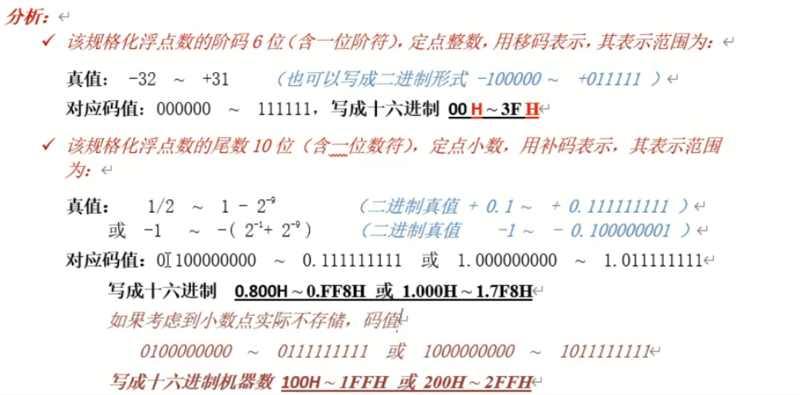

(2)  判断下列十进制数能否表示成此格式的规格化浮点数，若可以，请写出对应的码值。

① 3.14；  ② －1917；  ③ 105/512；  ④ －10-6；  ⑤ 1010

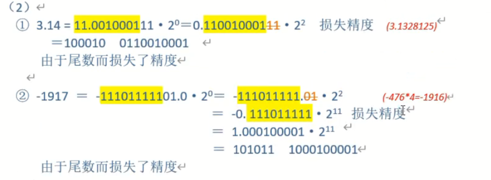

### 习题2.22

以IEEE 754短浮点数格式（32位）表示下列十进制数。

  ① ＋5.3125         ② －365.59375  

### 习题2.23

约定生成多项式为G(*x*)＝*x*3＋*x*＋1，试计算下述信息字的CRC编码字，并在接收端进行除法校验。

① 1010110

|                                                              |                                                              |
| ------------------------------------------------------------ | ------------------------------------------------------------ |
|  |  |

## 第三章：运算方法与运算器

### 习题3.10

若浮点数的阶码用移码表示，尾数用补码表示。两规格化浮点数相乘，最后对结果规格化时，右规的右移位数最多为几位？左规的左移位数最多为几位？为什么？

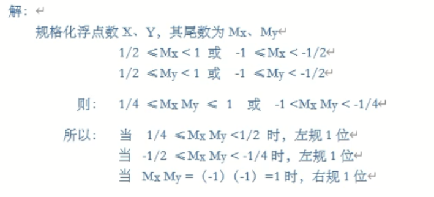

### 习题3.17

试依据下列条件，用补码计算[X]补 ＋[Y]补 = ？并判断结果有无溢出 ？ 

① X=0.01001    Y=－0.10111

② X=0.10010    Y=0.11000

### 习题3.20

根据题中的数据分别用 原码1位乘 及布斯（Booth）法 求乘积，并写出计算步骤。

① X=－0.1101    Y=＋0.0110

### 习题3.22

分别用 原码加减交替法 和 补码加减交替法 完成X除以Y的运算，并写出运算步骤。

① X=－0.10101       Y=＋0.11011

注意第四步此处左移时的操作。

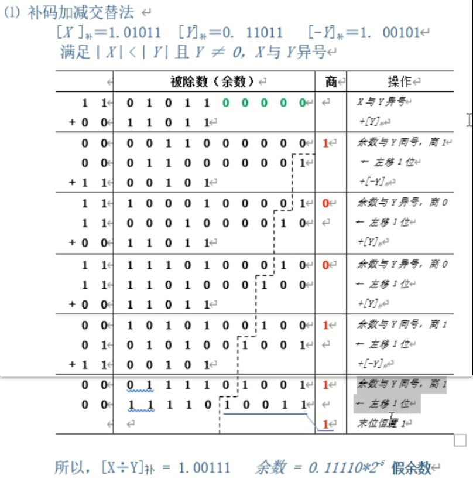

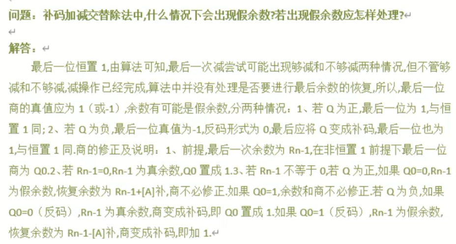

### 习题3.26

设浮点数字长12位，阶码5位（含1位符号），尾数7位（含1位符号）。阶码用移码、尾数用补码表示。将下列各数按浮点数相加减的步骤计算X±Y。

① X=11/16×2－4       Y=35/64×2－3 

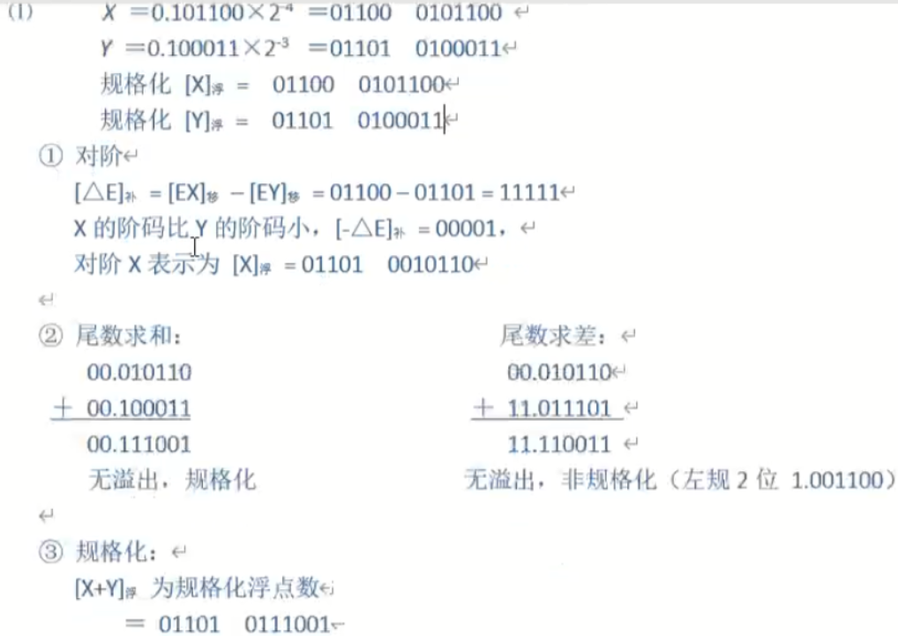

## 第四章：指令系统与汇编语言

### 习题4.2

某计算机14条指令的使用频度分别为0.15,0.15,0.14,0.13,0.12,0.11,0.04,0.04,0.03,0.03,0.02,0.02,0.01,0.01。

   试分别求出用等长（固定长度）码、霍夫曼编码、只有两种码长的扩展操作码这三种编码方式的平均码长。

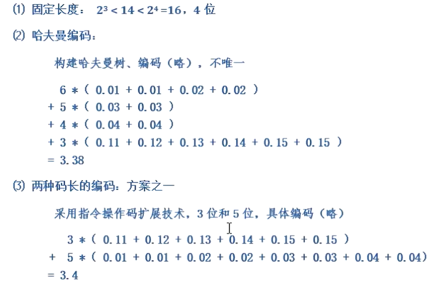

### 习题4.4

某计算机指令字长16位，设有单地址指令和双地址指令两类，若每个地址字段均为6位，且双地址指令有m条，那么单地址指令最多可以有多少？

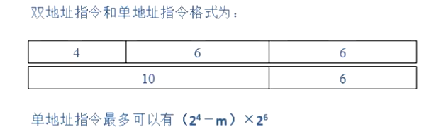

### 习题4.10

现有（BX）=0100H，（SI）=0002H，（0100H）=12H，（0101H）=34H，（0102H）=56H，（0103H）=78H，（1200H）=2AH，（1201）=4CH，（1202H）=B7H，（1203H）=65H，

试说明下列指令执行后AX的值。

 （1）MOV AX，1200H              （2）MOV AX，BX

 （3）MOV AX，[1200H]             （4）MOV AX，[BX]

 （5）MOV AX，1100H[BX]           （6）MOV AX，\[BX][SI]

 （7）MOV AX，1100H\[BX][SI]             

### 习题4.12

试编程序将内存从40000H到4BFFFH的每个单元中均写入55H，并再逐个单元读出比较，看写入的与读出的是否一致。若全对，则将AL置7EH；只要有错，则将AL置81H。

### 习题4.18

试编程序，统计由40000H开始的16KB个单元中所存放的字符“A”的个数，并将结果存放在DX中。

### 习题4.21

什么是CISC和RISC？它们的特点是什么？

CISC:

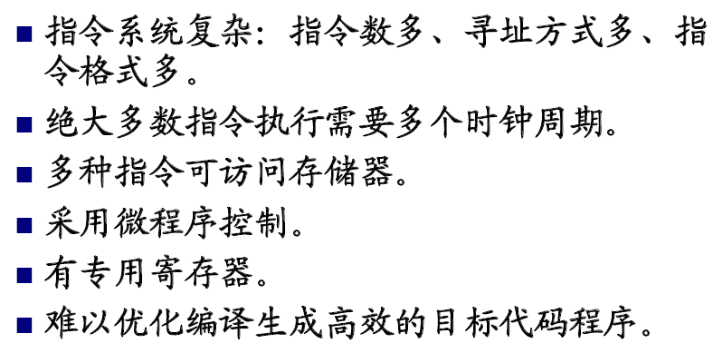

RISC:

## 第五章：中央处理器CPU

### 习题5.13

某微程序控制器采用的微指令字长为24位。微命令生成部分由4个字段构成，各字段所包括的互斥微命令分别为5个、8个、14个和3个。另外控制产生次地址的条件有3种。试说明该微控制器最多可用几位来表示次地址？控制存储器的容量为多少？

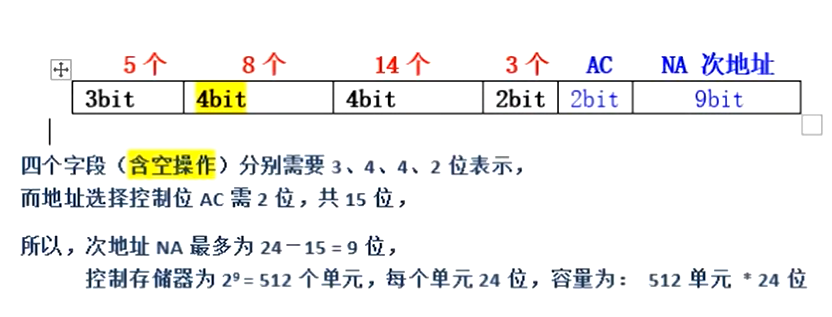

### 习题5.14

某计算机系统简化的CPU结构如图5.1所示，实现指令ADD AX, BX（功能为(AX)+(BX)→AX 时采用以下微操作流程：

   取指令：PC→AR

​          AR→AB，RD，PC+1

​          DB→DR

​          DR→IR

 执行指令：AX→S

​          BX→IB，ADD

​          ALU→T

​          T→AX

（1）依据此流程，写出实现加法指令ADD AX, (BX)的微流程。说明：该指令中(BX)为寄存器间接寻址，指令功能为(AX)+（（BX))→AX，RD为存储器读控制信号，ADD为运算器加法控制信号。

（2）试拟出加法指令ADD AX，DISP(SI)的微流程。其中DISP(SI)表示变址寻址，DISP是偏移量，SI是变址寄存器。

（3）拟出减法指令SUB  BX,100(DI)的指令微流程。	

(1)

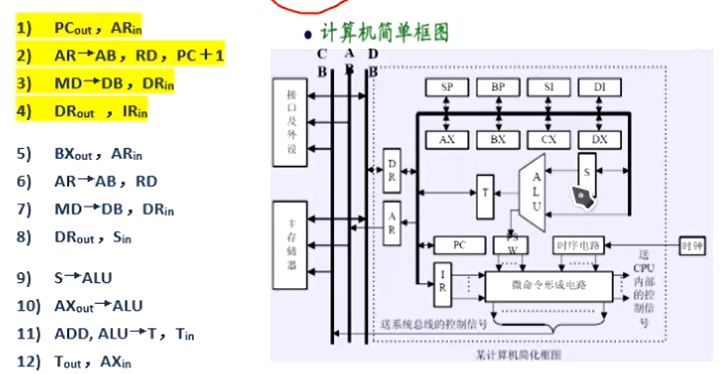 

(2)

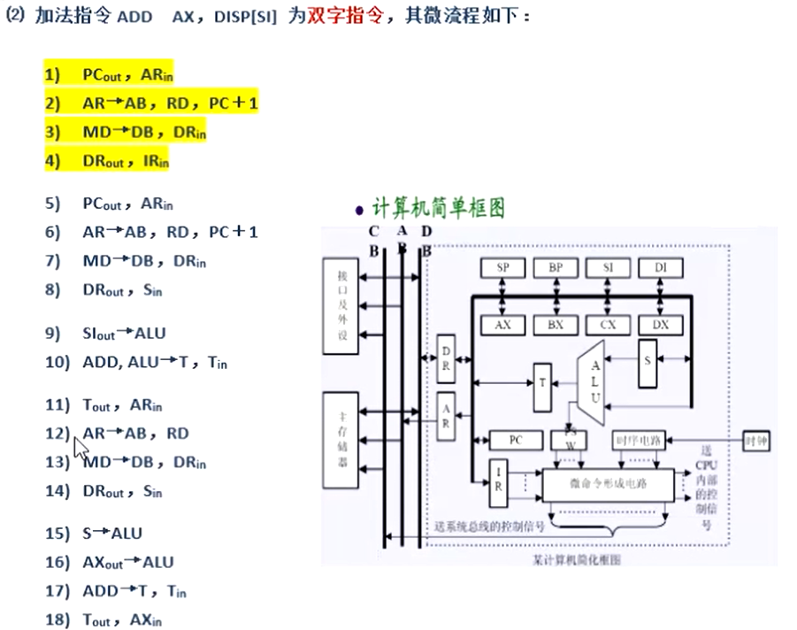

(3)

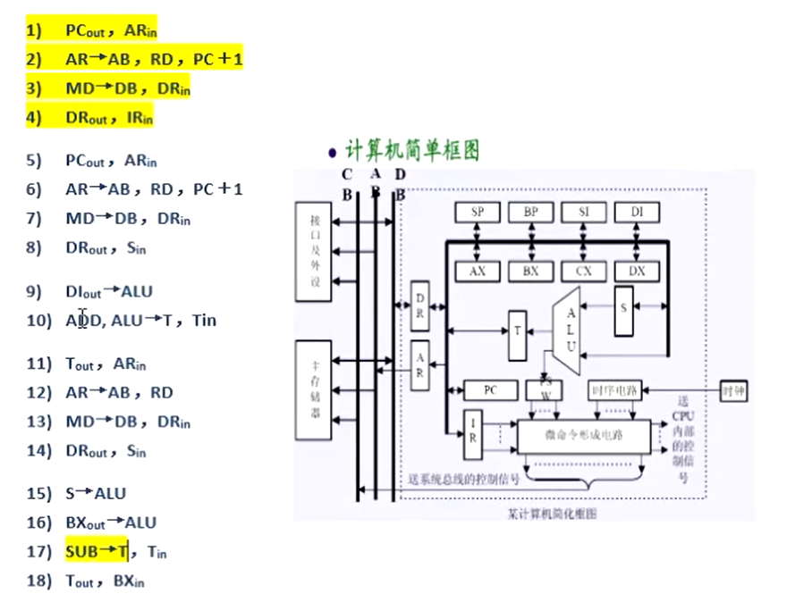

### 习题5.15

 下图5.34为某一运算器的简化框图，其中A、B既有寄存器又有多路选择器的功能，M有移位和选择器的功能，ALU为算术逻辑单元，R0和R1为通用寄存器。图中粗线为数据通路，是一种单总线结构。带下标in者为数据存入该寄存器的微命令，带下标out者为将该寄存器的内容输出的微命令，XX→ALU、ADD、＋1、V、L等均为微命令。

（1）根据图中所示，选择括号中的正确答案。

​       ① R0out，Ain （相容／互斥）  ② V，R，L       （相容／互斥）

​       ③ R0out，R1out（相容／互斥）  ④ A→ALU，ADD，V  （相容／互斥）

​       ⑤ ADD , AND  相容／互斥）   

（2）若2((R0)－1)→R0的微命令序列如下所示：

​    ① R0out，Bin，   ；(R0)→B

​    ② B→ALU，全1→ALU，ADD，L，R0in ；((B)－1)×2→R0

试写出执行(R0) OR (R1)→R0所需的微命令序列。

(1)

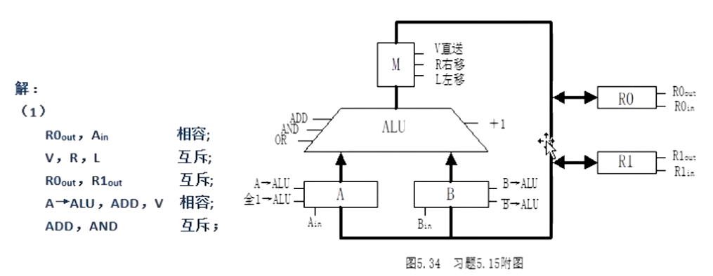

(2)

### 习题5.17

某CPU结构如图5.36中虚框内所示，其中包括一个累加寄存器AC、一个状态寄存器和其他四个寄存器，各部分之间的连线表示数据通路，箭头表示信息传送方向。

（1）图中的四个寄存器A、B、C、D分别是什么功能的寄存器？

（2）写出LDA  X指令执行阶段的微操作流程(X为内存地址，LDA X功能为(X)→AC ) 。

（3）写出STA Y指令执行阶段的微操作流程(Y为内存地址，STA Y功能为(AC)→((Y))。

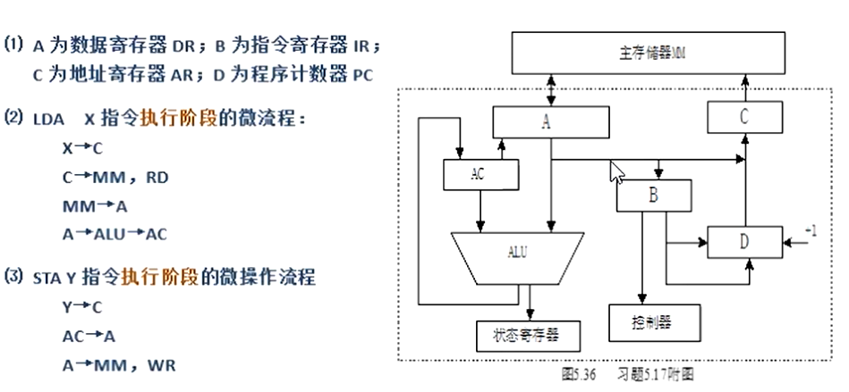