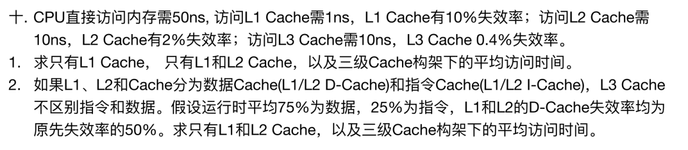

## 简答题（8选6，每题7分）

1. 某总线的时钟频率是100Mhz，数据线是16位，一个内存读写总线周期由4个时钟周期完成。在该总线上实现00000H--07FFFH的内存区域，需要8K*4的SRAM共多少片？若该SRAM的存储周期为50ns，请分析它是否能满足该总线的速度要求，给出理由。类似“地址04000H~07FFFH，16位系统，芯片8k×4b，问需多少片”。注意系统位数对答案的影响，答案是16片。
2. 已知Cache为3块，CPU执行程序顺序为***，求LRU求命中率。是第7章书上课后习题第31题，数据都没变
3. 给出磁记录方式图，问是哪种方式。（PPT中内容）
4. 中断向量码，给出中断向量表图问中断向量码&内容。
5. 超标量、超流水、超标量超流水性能分析。
6. 外设统一编码的优缺点，为什么输出需要锁存器。（前一问为课后题，后一问看书可找到答案）
7. 8259如何实现固定优先级，已知IR1为INT xx 求IR6。
8. 简述MPP的特点。（课本上可找到答案）

## 大题 (4道，共58分)
> 1. 流水线五个过程，5，5，15，10，5。
>    1. 性能指标计算，最大吞吐率。
>    2. 瓶颈消除。（限制重复瓶颈过程）画出时空图。
> 2. 已知连接图，求内存范围。（两片6264，稍难于课后题）
> 3. 计算机Cache与内存采⽤8路组相联⽅式映射，Cache容量为16KB，Cache组内每块1KB；内存容量1MB。 问：1.内存区号、区内组号、组内块号、块内地址号各多少位表示； 2. 设当前地址变换表如下，地址变换表分组顺序排列（第1⾏对应第0组第0块，第2⾏对应第0组第1块…），求0xABCDEH变换后Cache地址。
>    1. 给出主存的区、组、块、块内地址位数。
>    2. 由主存地址求Cache地址。
> 4. 8253与8088相连实现LED灯间断 1s亮，9秒灭。(方波+频率发生器)

##附加题

> 1. RZ码，01串图。（//此题有些奇怪，不太符合常规，相较于计组，更像计网题目）
>    1. 求该串的ASCII值；
>    2. 求波特率
> 2. Cache指令数据分离，平均访问时间。类似下题。

今年（2020）难度较低。

​																																	Summarized by Levick Cheng
