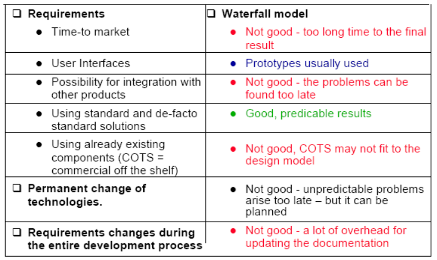

# 软件工程概论

## Chp1：Introduction概论

### What is software

`Software consists of ?软件组成`: program+data+document.(软件 = 程序 + 数据 + 文档)

`Characteristics of Software软件特点`: Invisibility, logicality, flexibility(不可见性，逻辑性，灵活性)

` Development requires开发（对软件工程师）要求?`analysis and synthesis（分析，整合）

`What we need to solve the problem?`: Method, tool, procedure, paradigm(方法，工具，流程，范式)

### software crisis

`software crisis,reason:`over-budget, over-time, inefficient, low-quality, fail to meet the requirement, difficult to maintain.

`people`-->`error`-->`fault`-->`failure`

`Three ways of considering quality`: the quality of product, process, the product in the context of the bussiness environment.

### Who does the software?

Customer, developer, user.(stakehoulder) (figure out what they mean and the relationship)

### System approach

pay attention to following definition: `activity`, `object`, `relationship`, `system boundary`. 

element of a system, interelated systems

### Members of the Development team

> - `Requirement analysts`: work with the customers to identify and document the requirements
> - ` Designers`: generate a system-level description of what the system us supposed to do
> - ` Programmers`: write lines of code to implement the design
> - ` Testers`: catch faults
> - ` Trainers`: show users how to use the system
> - ` Maintenance team`: fix faults that show up later
> - ` Librarians`: prepare and store documents such as software requirements
> - ` Configuration management team`: maintain correspondence among various artifacts

### What is good software

> - 产品的质量模型--------McCall's quality model
> - 过程的质量模型
>   - SEI's Capacity Maturity Model(CMM)
>   - ISO 9000
>   - Software Process Improvement and Capability determination (SPICE)
> - 商业环境中的质量
>   - ROI （Return on Investment）投资回报

## Chp2: Modeling the Process and Life Cycle

### Process

`Definition: `

> A set of ordered tasks
> A series of steps involving activities, constraints, and resources that produce an intended output of some kind.

`Software process`: 

 A process defines who is doing what, when and how, in order to reach a certain goal.

Sequence of development activities.

` Life cycle`: 

when the process involves the building of some product, we sometimes refer to the process as a life cycle.

### Software process model

`General process`: analysis---->design---->coding---->testing---->operation&maintenance

#### Waterfall model

requirement analysis--> system design --> program design --> coding --> unit&integration testing --> system testing --> acceptance testing --> operation&maintenance

> - advantages
>   - The waterfall model can be very useful in helping developers lay out what they need to do.
>   - Its simplicity makes it easy to explain to customers who are not familiar with software development.
>   - it makes explicit which intermediate products are neces­sary in order to begin the next stage of evelopment. <u>*(Text book P49, bottom paragraph)*</u>
> - disadvantages
>   - There is no insight into how each activity transform one artifact to another, such as requirements to design.
>   -  Its failure to treat software as a problem-solving process. <u>*(PPT 17)*</u>

**Waterfall model fitness**

#### V model

Similar to waterfall model. But we use the later steps to vefiry or validate the correctness of the former steps.

If there are problems, we can re-excute the form steps before the latter steps re-enact.

`Validation` ensures that the system has implemented all of the requirements.

`Verification` ensures that each function works correctly. 

> features:
>
> unit&integration testing ------veriry -----> program design
>
> system testing -----validate---->system design
>
> acceptance testing----validate---->requirement analysis
>
> If problems are found during verification and validation, the left side of the V can be re-executed before testing on the right side is re-enacted.

#### Spirial model

characteristics:

> - combines development activities with risk management to control and minimize risks.
> - It's presented as a spiral in which each iteration represented by a circuit around four main phases
>   - plan
>   - determine goals, alternatives and constraints.
>   - evaluate alternatives and risks.
>   - develop and test.

#### Prototype model 

characteristics:

> - allows repeated investigation of the requirements and design.
> - reduced risks and uncetainty in the development.

### Phased Development - Increments and Iterations

> - Incremental development: starts with small functional subsystem and adds functionality with each new release
>   – Divide project into builds
> -  Iterative development: starts with full system, then changes functionality of each subsystem with each new release